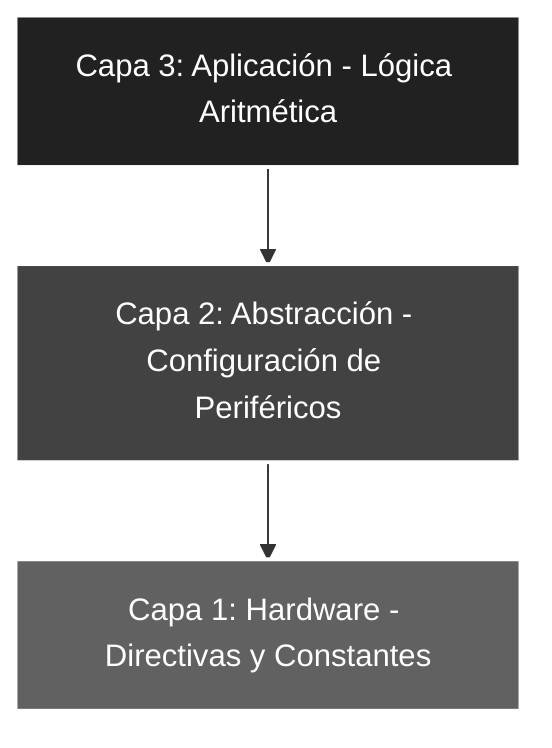

# 🚀 Elemental_01: Procesamiento Aritmético (Suma de Puerto + Constante)

## 🎯 Objetivos del Proyecto
* **Uso de la ALU:** Implementar operaciones aritméticas básicas utilizando la Unidad Lógica Aritmética del microcontrolador.
* **Manejo de Literales:** Utilizar la instrucción `ADDLW` para sumar valores constantes directamente al registro de trabajo **W**.
* **Robustez en el Inicio:** Aplicar técnicas de inicialización de periféricos para evitar estados indeterminados en el encendido.

---

## 📖 Teoría de Operación
Este proyecto marca la transición de la simple transferencia de datos al **procesamiento de información**. El sistema lee un valor binario variable desde el Puerto A (RA0-RA4), le suma una constante decimal fija (.74) y despliega el resultado en el Puerto B. 

Este flujo es la base de los sistemas de instrumentación donde se requiere aplicar un *offset* o factor de corrección a una señal digital de entrada antes de su visualización.

---

## 🏗️ Arquitectura del Software (Modelo de 3 Capas)

El desarrollo se organiza bajo una estructura jerárquica para asegurar la escalabilidad y facilitar el mantenimiento del código:



#### 🔹 Detalle Capa 1: Hardware y Directivas
Se definen los parámetros críticos del silicio y la constante decimal que se utilizará como operando fijo en la ALU para el procesamiento aritmético.

```asm
;--- CAPA 1: DEFINICIÓN DE CONSTANTES ---
CONSTANTE   EQU     .74             ; Valor decimal (.74) a sumar
ENTRADAS    EQU     b'00011111'     ; Configuración de RA0-RA4 como entradas
```
#### 🔹 Detalle Capa 2: Configuración de Periféricos
Gestión técnica de la dirección de datos y limpieza de puertos para asegurar un estado inicial conocido, libre de basura electrónica y estados indeterminados.

```asm
;--- CAPA 2: CONFIGURACIÓN ---
INICIO
    BSF     STATUS, RP0     ; Acceso al Banco 1 (Configuración de registros TRIS)
    MOVLW   ENTRADAS
    MOVWF   TRISA           ; Configura Puerto A para lectura de sensores (Entrada)
    CLRF    TRISB           ; Puerto B como salida completa para actuadores (Salida)
    BCF     STATUS, RP0     ; Regreso al Banco 0 (Operación de registros PORT)
    
    CLRF    PORTB           ; ROBUSTEZ: Asegura salidas en 0V al iniciar el programa
```
🔹 Detalle Capa 3: Lógica de Aplicación

Integración de funciones aritméticas utilizando el acumulador W como registro de procesamiento central.
Fragmento de código

;--- CAPA 3: LÓGICA DE APLICACIÓN ---
MAIN
    MOVF    PORTA, W        ; Captura en tiempo real el valor de los interruptores
    ADDLW   CONSTANTE       ; Operación ALU: W = W + 74 (Decimal)
    MOVWF   PORTB           ; Vuelca el resultado del cálculo en el array de LEDs
    GOTO    MAIN            ; Bucle cerrado infinito de procesamiento continuo
```
### 🛠️ Detalles de Robustez
* **Inicialización Segura:** El uso de `CLRF PORTB` inmediatamente después de la configuración de los registros `TRIS` garantiza la eliminación de picos de tensión o estados lógicos erráticos en los actuadores durante el arranque del sistema.
* **Eficiencia de la ALU:** La instrucción `ADDLW` (Add Literal to W) se ejecuta en un solo ciclo de instrucción ($1\mu s$ a $4MHz$), permitiendo un procesamiento determinístico y de alta velocidad, crítico para aplicaciones de control en tiempo real.
* **Vector de Seguridad:** Se mantiene el resguardo en `ORG 04h` con la instrucción `RETFIE` para blindar el flujo de ejecución contra ruidos electromagnéticos o fallos de hardware que pudieran forzar saltos de memoria inesperados.

---

### 🗺️ Mapeo de Hardware

| Periférico | Pin PIC16F84A | Configuración | Función |
| :--- | :--- | :--- | :--- |
| **Interruptores** | RA0 - RA4 | Entrada (Pull-down) | Operando Variable (Entrada) |
| **Valor Decimal** | Interno (ROM) | Constante (.74) | Operando Fijo (Offset) |
| **LED Array** | RB0 - RB7 | Salida (Output) | Visualización del Resultado |
| **Reset** | Pin 4 (MCLR) | Pull-up Externo | Reseteo físico del sistema |
| **Oscilador** | OSC1 / OSC2 | Modo XT (4 MHz) | Reloj maestro del sistema |

---

### 🎓 Conclusión
Este proyecto implementa una **Unidad de Procesamiento Aritmético Básica**. Demuestra la eficiencia de la arquitectura Harvard del **PIC16F84A** al procesar datos externos y realizar cálculos matemáticos de forma síncrona, estableciendo las bases técnicas para el desarrollo de sistemas de control por lazo abierto más complejos.

---
🛠️ *Estudiante de Ing. Electrónica @UTN_FRT | Apasionado por los Sistemas Embebidos y el Low-level (ASM/C).*