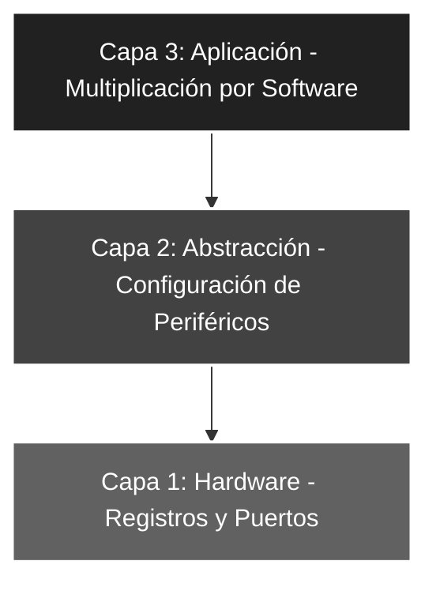

# 🚀 Elemental_02: Multiplicación por Software (Suma de Registros)

## 🎯 Objetivos del Proyecto
* **Aritmética de Registros:** Implementar la suma de un registro consigo mismo utilizando la instrucción `ADDWF`.
* **Optimización Matemática:** Realizar una multiplicación por 2 ($K=2$) sin recurrir a algoritmos complejos, aprovechando la velocidad nativa de la ALU.
* **Manejo de Operandos:** Gestionar el flujo de datos entre el acumulador **W** y los puertos físicos de forma síncrona.

---

## 📖 Teoría de Operación
En la programación de bajo nivel, las operaciones aritméticas simples como la multiplicación por potencias de 2 ($2^n$) pueden realizarse de forma ultra eficiente sin necesidad de algoritmos complejos, utilizando el propio acumulador como sumador simétrico.

---

### 📝 Fundamentos de la Instrucción ADDWF
La instrucción `ADDWF f, d` (*Add W to f*) suma el contenido del acumulador **W** con el contenido de un registro de dirección **f**. El destino del resultado depende del bit **d**:
* Si `d = 0` (W), el resultado se guarda en el acumulador.
* Si `d = 1` (F), el resultado se guarda en el registro original.

#### **Lógica de Duplicación (Multiplicación x2)**
La operación implementada en este proyecto sigue la lógica de suma sucesiva:
$$Resultado = Entrada + Entrada = 2 \times Entrada$$

#### **Equivalencia con Bit-Shifting**
En términos de bits, sumar un número por sí mismo es equivalente a realizar un **desplazamiento lógico a la izquierda (LSL)**. 
* **Entrada (5):** `b'00000101'`
* **Suma (5+5):** `b'00001010'` (Resultado: 10)
* *Observación: Todos los bits se desplazaron una posición a la izquierda.*

**Ejemplo Práctico en el Proyecto:**
1. **Captura:** Se lee el `PORTA` y se carga el valor en **W**.
2. **Procesamiento:** Se ejecuta `ADDWF PORTA, W`. La ALU toma el valor de los pines físicos y le suma el valor que ya tenía en el acumulador.
3. **Salida:** El `PORTB` refleja el doble de la entrada original.

> **Nota Técnica:** Este método de "Amplificador Digital" es significativamente más rápido que llamar a una subrutina de multiplicación, aprovechando el determinismo de la arquitectura RISC.

---

## 🏗️ Arquitectura del Software (Modelo de 3 Capas)

El desarrollo se organiza bajo una estructura jerárquica para asegurar la escalabilidad y facilitar el mantenimiento del código:


#### 🔹 Detalle Capa 1: Hardware y Directivas
Se define la máscara de entrada para el Puerto A, limitando la lectura a los 5 pines físicos disponibles en el microcontrolador y estableciendo la base para la configuración de registros.

```asm
;--- CAPA 1: DEFINICIÓN DE CONSTANTES ---
ENTRADAS    EQU     b'00011111'     ; Configuración de RA0-RA4 como entradas (1)
```
#### 🔹 Detalle Capa 2: Configuración de Periféricos
Gestión técnica de la dirección de datos y estabilización del sistema mediante la limpieza de los registros de salida, asegurando un entorno de ejecución libre de estados indeterminados.

```asm
;--- CAPA 2: CONFIGURACIÓN ---
INICIO
    BSF     STATUS, RP0     ; Acceso al Banco 1 (Configuración de registros TRIS)
    MOVLW   ENTRADAS
    MOVWF   TRISA           ; Puerto A como entrada de datos (Sensores/Switches)
    CLRF    TRISB           ; Puerto B como salida completa (Actuadores/LEDs)
    BCF     STATUS, RP0     ; Regreso al Banco 0 (Operación de registros PORT)
    
    CLRF    PORTB           ; ROBUSTEZ: Asegura estado lógico bajo (0V) al iniciar
```
#### 🔹 Detalle Capa 3: Lógica de Aplicación
Implementación de la suma de registros para lograr la duplicación del valor de entrada con mínima latencia, aprovechando el acumulador **W** como operando intermedio.

```asm
;--- CAPA 3: LÓGICA DE APLICACIÓN ---
MAIN
    MOVF    PORTA, W        ; Lee PORTA y almacena el valor en el acumulador W
    ADDWF   PORTA, W        ; Operación ALU: W = PORTA + W (Resultado: 2 * PORTA)
    MOVWF   PORTB           ; Despliega el producto final en el Puerto B
    GOTO    MAIN            ; Bucle cerrado infinito de procesamiento continuo
```
### 🛠️ Detalles de Robustez
* **Eficiencia Aritmética:** Al utilizar la instrucción `ADDWF`, el cálculo se realiza en un solo ciclo de instrucción ($1\mu s$ a $4MHz$ con el divisor interno), lo que garantiza una respuesta en tiempo real y determinística ante cambios en la entrada.
* **Prevención de Desbordamiento:** Dado que la entrada física está limitada a 5 bits (valor máximo 31), el resultado de la duplicación será como máximo 62. Esto permite operar con total seguridad dentro de los 8 bits del Puerto B sin riesgo de desbordar el registro o requerir gestión del bit de *Carry*.
* **Determinismo de Control:** El bucle `MAIN` asegura que el microcontrolador esté dedicado exclusivamente al procesamiento de la señal, manteniendo la salida actualizada de forma constante y síncrona.

---

### 🗺️ Mapeo de Hardware

| Periférico | Pin PIC16F84A | Configuración | Función |
| :--- | :--- | :--- | :--- |
| **Interruptores** | RA0 - RA4 | Entrada (Pull-down) | Operando Variable (Valor X) |
| **LED Array** | RB0 - RB7 | Salida (Output) | Resultado Aritmético (2 * X) |
| **Reset** | Pin 4 (MCLR) | Pull-up Externo | Reseteo físico del sistema |
| **Oscilador** | OSC1 / OSC2 | Modo XT (4 MHz) | Reloj maestro del sistema |

---

### 🎓 Conclusión
Este proyecto demuestra cómo el uso estratégico de las instrucciones de la ALU permite realizar funciones matemáticas complejas de manera eficiente. La técnica de sumar un registro consigo mismo es un pilar fundamental en la manipulación de datos binarios y el preludio técnico necesario para el estudio de desplazamientos lógicos (*bit-shifting*) en arquitecturas de mayor escala.

---
🛠️ *Estudiante de Ing. Electrónica @UTN_FRT | Apasionado por los Sistemas Embebidos y el Low-level (ASM/C).*