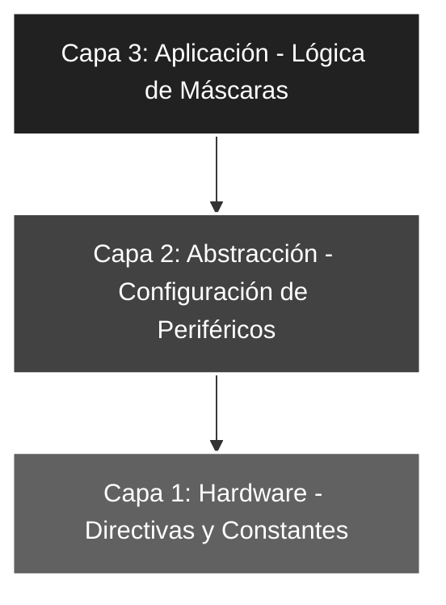

# 🚀 Elemental_03: Introducción a las Máscaras de Bits (Lógica Booleana)

## 🎯 Objetivos del Proyecto
* **Manipulación Bitwise:** Aprender a utilizar operaciones lógicas (`ANDLW`, `IORLW`) para modificar bits específicos sin alterar el resto del registro.
* **Filtrado de Entradas:** Implementar una máscara de seguridad para limpiar bits no utilizados del Puerto A.
* **Forzado de Estados:** Aplicar una máscara de inyección para asegurar que los bits pares estén siempre en nivel alto (1).

---

## 📖 Teoría de Operación
En el desarrollo de sistemas embebidos, la manipulación de bits individuales es una técnica crítica. Este proyecto procesa la entrada mediante dos etapas lógicas consecutivas:

1. **Máscara AND (Filtro):** Asegura que solo los 5 bits físicos del Puerto A lleguen al acumulador, eliminando cualquier "ruido" en los bits 5, 6 y 7.
2. **Máscara OR (Inyección):** Utiliza la propiedad del **Elemento Neutro** de la función lógica OR ($A + 0 = A$) para forzar el encendido de bits específicos sin alterar el resto del registro.

---

### 📝 Fundamentos de la Máscara OR
Para encender bits selectivamente, aplicamos la siguiente lógica booleana sobre el acumulador:

#### **Tabla de Verdad OR**
| Entrada A | Entrada B | Resultado (A + B) |
| :---: | :---: | :---: |
| 0 | 0 | **0** (Mantiene 0) |
| 0 | 1 | **1** (Enciende) |
| 1 | 0 | **1** (Mantiene 1) |
| 1 | 1 | **1** (Enciende) |


#### **Lógica de Encendido Selectivo**
Al aplicar una máscara con la instrucción `IORLW`, el comportamiento sobre cada bit del estado previo es:
* **`estado_previo | 0` = `estado_previo`**: El bit conserva su valor original (0 es el neutro).
* **`estado_previo | 1` = `1`**: El bit se fuerza a nivel alto (1 es el dominante).

**Ejemplo Práctico (Fijar bits pares):**
Si el `PORTA` tiene un estado desconocido representado por `x`:
`xxxx xxxx` | `0101 0101` = `x1x1 x1x1`

> **Nota Técnica:** Como se observa en el resultado, los bits en las posiciones donde la máscara tiene un '1' se encienden obligatoriamente, mientras que las posiciones con '0' mantienen su estado original `x`.

---

## 🏗️ Arquitectura del Software (Modelo de 3 Capas)

El desarrollo se organiza bajo una estructura jerárquica para asegurar la escalabilidad y facilitar el mantenimiento del código:


#### 🔹 Detalle Capa 1: Hardware y Directivas
Se definen las constantes lógicas que actuarán sobre el flujo de datos. El uso de formato binario permite visualizar directamente la correspondencia física de los bits que serán afectados por las operaciones de filtrado e inyección.

```asm
;--- CAPA 1: DEFINICIÓN DE CONSTANTES ---
ENTRADAS    EQU     b'00011111'    ; Configuración de RA0-RA4 como entradas
MASCARASW   EQU     b'00011111'    ; Filtro para asegurar solo los 5 bits de RA
MASCARA_OR  EQU     b'01010101'    ; Máscara para fijar bits pares (0,2,4,6) en 1
```
#### 🔹 Detalle Capa 2: Configuración de Periféricos

Gestión técnica de la dirección de datos y estabilización inicial del sistema para evitar estados lógicos erráticos en el arranque.

```asm
;--- CAPA 2: CONFIGURACIÓN ---
INICIO
    BSF     STATUS, RP0     ; Acceso al Banco 1 (Configuración de TRIS)
    MOVLW   ENTRADAS
    MOVWF   TRISA           ; Puerto A como entrada de sensores
    CLRF    TRISB           ; Puerto B como salida completa de actuadores
    BCF     STATUS, RP0     ; Regreso al Banco 0 (Operación de PORT)
    
    CLRF    PORTB           ; ROBUSTEZ: Asegura salidas en 0V al iniciar el program
```
#### 🔹 Detalle Capa 3: Lógica de Aplicación

Integración de funciones de álgebra de Boole sobre el acumulador W antes de volcar el resultado a los pines físicos.

```asm
;--- CAPA 3: LÓGICA DE APLICACIÓN ---
MAIN
    MOVF    PORTA, W        ; Captura el valor de los interruptores en W
    ANDLW   MASCARASW       ; Operación AND: Limpia bits inexistentes (5, 6 y 7)
    IORLW   MASCARA_OR      ; Operación OR: Fuerza bits pares a '1' (Inyección)
    MOVWF   PORTB           ; Vuelca el resultado procesado en el array de LEDs
    GOTO    MAIN            ; Bucle cerrado infinito de procesamiento continuo
```
### 🛠️ Detalles de Robustez
* **Blindaje de Software (AND):** Al aplicar la máscara `ANDLW`, el programa ignora cualquier estado en los pines RA5, RA6 y RA7 (no implementados físicamente en este modelo), evitando que "basura digital" o estados de alta impedancia ensucien el cálculo en el acumulador.
* **Determinismo de Salida (OR):** El uso de `IORLW` garantiza que ciertos indicadores (bits pares) permanezcan activos siempre. Esta técnica es vital para implementar señales de *Heartbeat* o mantener bits de control de periféricos sin afectar la lógica de usuario.
* **Seguridad de Memoria:** Se mantiene el resguardo en el vector de interrupción `ORG 04h` con la instrucción `RETFIE`, blindando el flujo de ejecución principal ante cualquier salto accidental por ruido electromagnético.

---

### 🗺️ Mapeo de Hardware

| Periférico | Pin PIC16F84A | Configuración | Función |
| :--- | :--- | :--- | :--- |
| **Interruptores** | RA0 - RA4 | Entrada (Pull-down) | Captura de datos brutos |
| **Lógica OR** | Interna (ALU) | b'01010101' | Forzado de bits pares a '1' |
| **LED Array** | RB0 - RB7 | Salida (Output) | Resultado procesado final |
| **Reset** | Pin 4 (MCLR) | Pull-up Externo | Reseteo físico del sistema |
| **Oscilador** | OSC1 / OSC2 | Modo XT (4 MHz) | Reloj maestro del sistema |

---

### 🎓 Conclusión
Este proyecto introduce el concepto fundamental de la **Manipulación Bitwise**. Es una herramienta indispensable en el desarrollo de drivers de bajo nivel, permitiendo encender pines específicos (OR) o filtrar lecturas (AND) sin alterar la integridad del resto del registro, optimizando así el uso de recursos y garantizando un control preciso sobre el hardware.

---
🛠️ *Estudiante de Ing. Electrónica @UTN_FRT | Apasionado por los Sistemas Embebidos y el Low-level (ASM/C).*