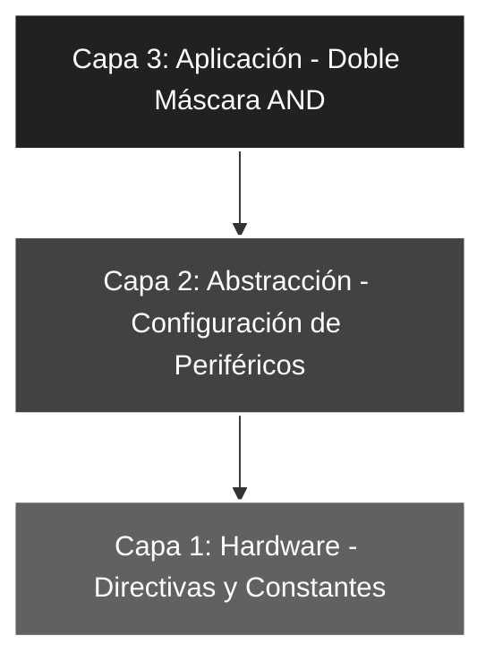

# 🚀 Elemental_04: Máscaras de Bits II (Filtrado por Anulación)

## 🎯 Objetivos del Proyecto
* **Lógica de Anulación:** Utilizar la operación `ANDLW` para forzar bits específicos a nivel bajo (0) sin afectar la lógica de los bits restantes.
* **Seguridad de Bus:** Implementar máscaras consecutivas para asegurar que solo la información relevante llegue a la salida.
* **Control de Bits Impares:** Garantizar que los bits impares (1, 3, 5, 7) permanezcan siempre apagados, independientemente de la entrada.

---

## 📖 Teoría de Operación
A diferencia del proyecto anterior donde usamos una compuerta OR para fijar unos, aquí aplicamos el **Elemento Neutro y Absorbente** de la compuerta AND. 

Al realizar un `AND` entre la entrada y la `MASCARA_AND` (b'01010101'):
1. Los bits en posición **par** se comparan con '1' (neutro), manteniendo su estado original.
2. Los bits en posición **impar** se comparan con '0' (absorbente), forzando un '0' lógico en la salida.

---

## 🏗️ Arquitectura del Software (Modelo de 3 Capas)

El desarrollo se organiza bajo una estructura jerárquica para asegurar la escalabilidad:


#### 🔹 Detalle Capa 1: Hardware y Directivas
Se definen las constantes de filtrado y configuración del silicio. La `MASCARA_AND` está diseñada estratégicamente bajo el concepto de elemento absorbente de la compuerta AND, permitiendo "dejar pasar" solo los bits en posiciones pares.

```asm
;--- CAPA 1: DEFINICIÓN DE CONSTANTES ---
ENTRADAS     EQU    b'00011111'    ; Configuración de RA0-RA4 como entradas
MASCARASW    EQU    b'00011111'    ; Filtro de seguridad para asegurar solo 5 bits de entrada
MASCARA_AND  EQU    b'01010101'    ; Máscara para forzar bits impares (1,3,5,7) a 0 lógico
```
#### 🔹 Detalle Capa 2: Configuración de Periféricos
Configuración técnica de los registros de dirección de datos (`TRIS`) mediante el cambio de banco y ejecución de una limpieza preventiva del puerto de salida para garantizar un estado inicial seguro.

```asm
;--- CAPA 2: CONFIGURACIÓN ---
INICIO
    BSF     STATUS, RP0     ; Acceso al Banco 1 (Configuración de TRIS)
    MOVLW   ENTRADAS
    MOVWF   TRISA           ; Configura Puerto A para lectura (Input)
    CLRF    TRISB           ; Puerto B como salida completa (Output)
    BCF     STATUS, RP0     ; Regreso al Banco 0 (Operación de PORT)
    
    CLRF    PORTB           ; ROBUSTEZ: Asegura salidas en 0V al iniciar el programa
```
#### 🔹 Detalle Capa 3: Lógica de Aplicación
Implementación de un **doble filtrado AND** en cascada para garantizar la integridad de los datos procesados antes de ser volcados a los actuadores (LEDs).

```asm
;--- CAPA 3: LÓGICA DE APLICACIÓN ---
MAIN
    MOVF    PORTA, W        ; Captura el valor de los interruptores en W
    ANDLW   MASCARASW       ; Primer Filtro: Limpia bits 5, 6 y 7 (Seguridad de bus)
    ANDLW   MASCARA_AND     ; Segundo Filtro: Anula bits impares (Lógica de usuario)
    MOVWF   PORTB           ; Vuelca los valores procesados finales al Puerto B
    GOTO    MAIN            ; Bucle infinito de monitoreo continuo
```
### 🛠️ Detalles de Robustez
* **Filtrado Consecutivo:** El uso de dos instrucciones `ANDLW` seguidas demuestra una técnica de **capas de seguridad**; la primera limpia el bus de entrada de bits inexistentes y la segunda aplica la lógica de usuario sobre los datos ya saneados.
* **Determinismo Temporal:** La operación lógica completa se realiza en ciclos de instrucción fijos ($1\mu s$ por instrucción a $4MHz$), asegurando que la salida sea una respuesta inmediata, predecible y libre de fluctuaciones temporales.
* **Vector de Seguridad:** Se mantiene la buena práctica de incluir el `ORG 04h` con la instrucción `RETFIE` para blindar el flujo del programa ante ruidos electromagnéticos que pudieran provocar saltos accidentales en la memoria.

---

### 🗺️ Mapeo de Hardware

| Periférico | Pin PIC16F84A | Configuración | Función |
| :--- | :--- | :--- | :--- |
| **Interruptores** | RA0 - RA4 | Entrada (Pull-down) | Entrada de datos de usuario |
| **Lógica AND** | Interna (ALU) | b'01010101' | Anulación selectiva de bits impares |
| **LED Array** | RB0 - RB7 | Salida (Output) | Resultado visual procesado |
| **Reset** | Pin 4 (MCLR) | Pull-up Externo | Reseteo físico del sistema |
| **Oscilador** | OSC1 / OSC2 | Modo XT (4 MHz) | Reloj maestro del sistema |

---

### 🎓 Conclusión
Este proyecto cierra el estudio introductorio de las máscaras de bits. La capacidad de **anular selectivamente** información mediante la compuerta AND es el pilar fundamental para el manejo de *Flags* (banderas de estado) y el aislamiento de bits de control, permitiendo al desarrollador procesar únicamente la información requerida en cada etapa del programa.

---
🛠️ *Estudiante de Ing. Electrónica @UTN_FRT | Apasionado por los Sistemas Embebidos y el Low-level (ASM/C).*