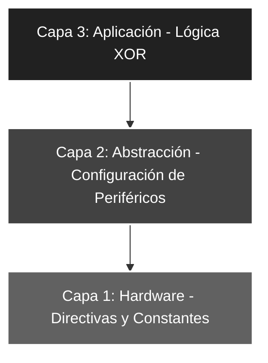

# 🚀 Elemental_05: Máscaras de Bits III (Inversión Selectiva con XOR)

## 🎯 Objetivos del Proyecto
* **Lógica de Inversión:** Utilizar la operación `XORLW` para invertir el estado lógico de bits específicos (Toggle).
* **Control de Fase:** Implementar un inversor por software que cambie los '1' por '0' y viceversa en la entrada.
* **Dominio de la ALU:** Comprender el uso de la XOR como herramienta de comparación y complemento.

---

## 📖 Teoría de Operación
En este proyecto utilizamos la **Propiedad de Inversión** de la función lógica XOR ($A \oplus B = Y$). A diferencia de la OR o la AND, la XOR actúa como un "conmutador" dependiendo del valor de la máscara.

### 📝 Fundamentos de la Máscara XOR
Para invertir bits selectivamente, aplicamos la siguiente lógica booleana sobre el acumulador:

#### **Tabla de Verdad XOR**
| Entrada A | Entrada B | Resultado (A ⊕ B) |
| :---: | :---: | :---: |
| 0 | 0 | **0** (Mantiene 0) |
| 0 | 1 | **1** (Invierte a 1) |
| 1 | 0 | **1** (Mantiene 1) |
| 1 | 1 | **0** (Invierte a 0) |

#### **Lógica de Inversión Selectiva**
Al aplicar una máscara con la instrucción `XORLW`, el comportamiento sobre cada bit del estado previo es:
* **`estado_previo ^ 0` = `estado_previo`**: El bit conserva su valor original (0 es el neutro).
* **`estado_previo ^ 1` = `!estado_previo`**: El bit invierte su estado lógico (1 es el inversor).

**Ejemplo Práctico (Invertir RA<4:0>):**
Si el `PORTA` tiene un estado desconocido representado por `x`:
`000x xxxx` ^ `0001 1111` = `000!x !x!x!x!x`

> **Nota Técnica:** Como se observa, los bits donde la máscara tiene un '1' resultan en el valor opuesto al original, mientras que los bits con '0' (como los bits 5, 6 y 7) permanecen inalterados.

---

## 🏗️ Arquitectura del Software (Modelo de 3 Capas)

El desarrollo se organiza bajo una estructura jerárquica para asegurar la escalabilidad:


#### 🔹 Detalle Capa 1: Hardware y Directivas
Se definen las constantes de filtrado y la configuración de la máscara de inversión. El uso de la base binaria permite identificar con precisión que la operación `XOR` afectará únicamente a los 5 bits de entrada implementados en el hardware.

```asm
;--- CAPA 1: DEFINICIÓN DE CONSTANTES ---
ENTRADAS     EQU    b'00011111'    ; Configuración de RA0-RA4 como entradas
MASCARASW    EQU    b'00011111'    ; Filtro de seguridad para asegurar solo 5 bits de RA
MASCARA_XOR  EQU    b'00011111'    ; Máscara de inversión selectiva (Toggle) para los 5 bits
```
#### 🔹 Detalle Capa 2: Configuración de Periféricos
Configuración técnica de los registros de dirección de datos (`TRIS`) mediante la conmutación al **Banco 1** y ejecución de una limpieza preventiva del puerto de salida para garantizar un estado inicial seguro.

```asm
;--- CAPA 2: CONFIGURACIÓN ---
INICIO
    BSF     STATUS, RP0     ; Acceso al Banco 1 (Configuración de registros TRIS)
    MOVLW   ENTRADAS
    MOVWF   TRISA           ; Configura Puerto A según la constante ENTRADAS
    CLRF    TRISB           ; Configura Puerto B como salida completa (Output)
    BCF     STATUS, RP0     ; Regreso al Banco 0 (Operación de registros PORT)
    
    CLRF    PORTB           ; ROBUSTEZ: Asegura salidas en 0V al iniciar el programa
```
#### 🔹 Detalle Capa 3: Lógica de Aplicación
Implementación de la inversión lógica por software mediante el uso del acumulador **W**. Esta capa procesa el flujo de datos aplicando un filtrado previo y un complemento selectivo antes del volcado final.

```asm
;--- CAPA 3: LÓGICA DE APLICACIÓN ---
MAIN
    MOVF    PORTA, W        ; Captura el valor de los interruptores en el acumulador W
    ANDLW   MASCARASW       ; Primer Filtro: Limpia bits 5, 6 y 7 (Seguridad de bus)
    XORLW   MASCARA_XOR     ; Operación XOR: Invierte lógicamente los 5 bits de entrada
    MOVWF   PORTB           ; Despliega el resultado complementado en el Puerto B
    GOTO    MAIN            ; Bucle cerrado infinito de procesamiento continuo
```
### 🛠️ Detalles de Robustez
* **Control de Fase Sólido:** El uso de la instrucción `XORLW` permite una inversión lógica limpia y directa sin necesidad de saltos condicionales o comparaciones (`BTFSS`/`BTFSC`), optimizando el uso de la memoria de programa y ahorrando ciclos de instrucción críticos.
* **Limpieza de Bus:** Al igual que en los proyectos anteriores, el primer `ANDLW` actúa como una capa de seguridad que garantiza que los bits no físicos (RA5-RA7) no ensucien la operación XOR posterior en el acumulador.
* **Determinismo Técnico:** El programa mantiene un flujo constante de ejecución (4 instrucciones por ciclo de refresco), lo que asegura una latencia mínima y una respuesta en tiempo real ante cambios en los interruptores de entrada.

---

### 🗺️ Mapeo de Hardware

| Periférico | Pin PIC16F84A | Configuración | Función |
| :--- | :--- | :--- | :--- |
| **Interruptores** | RA0 - RA4 | Entrada (Pull-down) | Captura de datos de entrada originales |
| **Lógica XOR** | Interna (ALU) | b'00011111' | Complemento de datos (Inversión selectiva) |
| **LED Array** | RB0 - RB7 | Salida (Output) | Visualización del resultado invertido |
| **Reset** | Pin 4 (MCLR) | Pull-up Externo | Reseteo físico del sistema |
| **Oscilador** | OSC1 / OSC2 | Modo XT (4 MHz) | Reloj maestro del sistema |

---

### 🎓 Conclusión
Este proyecto demuestra la versatilidad de la operación **XOR** para la manipulación de datos a bajo nivel. La capacidad de invertir bits de forma selectiva es fundamental para tareas de ingeniería como el parpadeo de LEDs (*Toggle*), la generación de señales en contrafase y la implementación de protocolos de comunicación donde se requiere complementar la información para detección de errores.

---
🛠️ *Estudiante de Ing. Electrónica @UTN_FRT | Apasionado por los Sistemas Embebidos y el Low-level (ASM/C).*