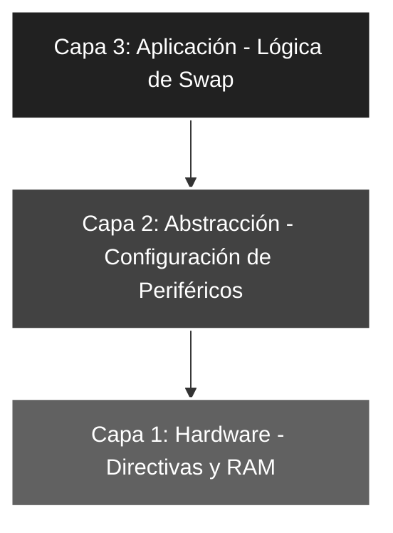

# 🚀 Elemental_06: Intercambio de Nibbles (SWAPF y Gestión de RAM)

## 🎯 Objetivos del Proyecto
* **Instrucción SWAPF:** Comprender el funcionamiento del intercambio de nibbles (4 bits superiores por inferiores) sin afectar los bits de estado de la ALU.
* **Gestión de Memoria RAM:** Implementar el uso de registros de propósito general (GPR) para el almacenamiento temporal de datos.
* **Transformación de Datos:** Visualizar cómo un valor de entrada en los bits bajos (`RA0-RA4`) se desplaza hacia la parte alta del puerto de salida.

---

## 📖 Teoría de Operación
La instrucción `SWAPF` es una de las más potentes del PIC16F84A para el procesamiento de datos. A diferencia de un desplazamiento (*shift*) que requiere múltiples ciclos, `SWAPF` intercambia los 4 bits más significativos por los 4 menos significativos en un solo ciclo de instrucción.

---

### 📝 Fundamentos de la Instrucción SWAPF
La sintaxis utilizada es `SWAPF f, d`. Si `d=W`, el resultado del intercambio se guarda en el acumulador, dejando el registro original intacto.

#### **Lógica de Intercambio (Nibbles)**
Si tenemos un registro con el valor `0xAB` (donde `A` es el nibble alto y `B` el bajo):
* **Estado Inicial:** `[A | B]` -> `[1010 | 1011]`
* **Ejecución SWAPF:** El microprocesador cruza los caminos de datos.
* **Estado Final:** `[B | A]` -> `[1011 | 1010]`

**Ejemplo Práctico en el Proyecto:**
1. Leemos `PORTA` (valor máximo b'00011111').
2. Filtramos con `MASCARASW` para asegurar que los bits 5, 6 y 7 sean '0'.
3. Al aplicar `SWAPF`, el valor de la entrada que estaba en el nibble bajo pasa al nibble alto del `PORTB`.

---

## 🏗️ Arquitectura del Software (Modelo de 3 Capas)

El desarrollo se organiza bajo una estructura jerárquica para asegurar la escalabilidad:


#### 🔹 Detalle Capa 1: Hardware y Directivas
Se define la ubicación del registro temporal en la memoria de datos (**RAM**). En la arquitectura del PIC16F84A, los Registros de Propósito General (**GPR**) comienzan en la dirección `0x0C`, punto donde el desarrollador tiene total libertad para el almacenamiento de variables dinámicas.

```asm
;--- CAPA 1: DEFINICIÓN DE CONSTANTES Y RAM ---
ENTRADAS    EQU     b'00011111'    ; Configuración de RA0-RA4 (Pines físicos)
MASCARASW   EQU     b'00011111'    ; Filtro de seguridad para el bus de entrada
Reg_Temp    EQU     0x0C           ; Registro Temporal en RAM (Dirección GPR inicial)
```
#### 🔹 Detalle Capa 2: Configuración de Periféricos
Gestión técnica de los registros de dirección de datos (`TRIS`) mediante el salto al **Banco 1**. Se establece la configuración física de los pines y se aplica una limpieza preventiva del puerto de salida para evitar transitorios durante el arranque del sistema.

```asm
;--- CAPA 2: CONFIGURACIÓN ---
INICIO
    BSF     STATUS, RP0     ; Acceso al Banco 1 (Configuración de dirección)
    MOVLW   ENTRADAS
    MOVWF   TRISA           ; Define RA0-RA4 como entradas de datos
    CLRF    TRISB           ; Define PORTB como salida completa (LEDs)
    BCF     STATUS, RP0     ; Regreso al Banco 0 (Operación de puertos)
    
    CLRF    PORTB           ; ROBUSTEZ: Garantiza estado lógico '0' al iniciar
```
#### 🔹 Detalle Capa 3: Lógica de Aplicación

Procesamiento de datos utilizando el registro temporal para permitir la manipulación antes del volcado final.

```asm
;--- CAPA 3: LÓGICA DE APLICACIÓN ---
MAIN
    MOVF    PORTA, W        ; Captura entrada en W
    ANDLW   MASCARASW       ; Sanea los datos
    MOVWF   Reg_Temp        ; Guarda en RAM para procesar
    SWAPF   Reg_Temp, W     ; Intercambia nibbles y guarda resultado en W
    MOVWF   PORTB           ; Vuelca el resultado desplazado a la salida
    GOTO    MAIN            ; Bucle infinito
```
### 🛠️ Detalles de Robustez
* **Uso de RAM No Volátil (GPR):** Al mover el dato a `Reg_Temp`, protegemos la integridad del valor original de entrada mientras realizamos la operación de swap hacia el acumulador, permitiendo auditorías de datos en procesos de depuración (GDB).
* **Eficiencia de Ciclos:** Una operación de desplazamiento de nibble mediante rotaciones requeriría 4 instrucciones `RLF`. Con `SWAPF`, logramos el mismo resultado en **1 solo ciclo de instrucción** ($1\mu s$), optimizando el tiempo de respuesta del procesador.
* **Aislamiento de Entradas:** El filtro `ANDLW` previo asegura que no se trasladen estados indeterminados (ruido) de los pines no implementados (RA5-RA7) hacia el nibble bajo tras el intercambio de posiciones.

---

### 🗺️ Mapeo de Hardware

| Periférico | Pin PIC16F84A | Configuración | Función |
| :--- | :--- | :--- | :--- |
| **Interruptores** | RA0 - RA4 | Entrada (Pull-down) | Valor de entrada (Nibble Bajo) |
| **Registro RAM** | Dirección 0x0C | Memoria GPR | Almacenamiento temporal de datos |
| **LED Array** | RB0 - RB7 | Salida (Output) | Resultado visual (Nibble intercambiado) |
| **Reset** | Pin 4 (MCLR) | Pull-up Externo | Reseteo físico del sistema |
| **Oscilador** | OSC1 / OSC2 | Modo XT (4 MHz) | Reloj maestro del sistema |

---

### 🎓 Conclusión
Este proyecto introduce el manejo de la memoria de datos y el procesamiento avanzado de registros mediante la instrucción **SWAPF**. Esta técnica es fundamental en aplicaciones de ingeniería más complejas, como el manejo de displays LCD en modo de 4 bits o la conversión de valores BCD a Binario, demostrando la alta eficiencia del set de instrucciones RISC de Microchip.

---
🛠️ *Estudiante de Ing. Electrónica @UTN_FRT | Apasionado por los Sistemas Embebidos y el Low-level (ASM/C).*