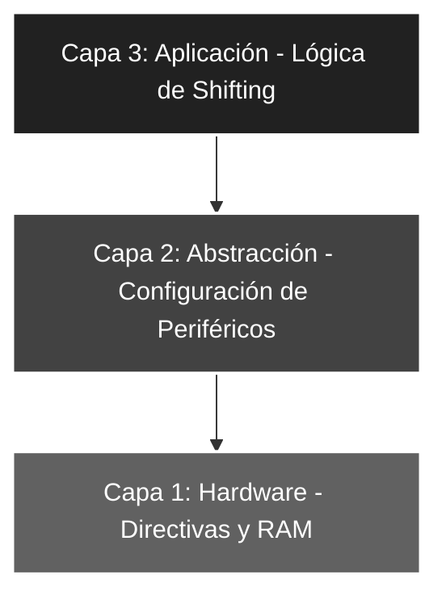

# 🚀 Elemental_07: Bit Shifting (Rotación y Gestión del Carry)

## 🎯 Objetivos del Proyecto
* **Instrucción RLF:** Comprender el desplazamiento de bits hacia la izquierda a través del registro de acarreo (*Carry*).
* **Manipulación del Status:** Aprender a forzar bits de estado (`BSF STATUS, C`) para controlar el dato entrante en una rotación.
* **Procesamiento de Datos:** Implementar un desplazamiento lógico que inserte un '1' por la derecha, alterando el valor binario original.

---

## 📖 Teoría de Operación
En microcontroladores PIC, el desplazamiento de bits se realiza mediante instrucciones de rotación. La instrucción `RLF` (*Rotate Left f through Carry*) desplaza todos los bits una posición a la izquierda, donde el Bit 7 pasa al *Carry* y el valor previo del *Carry* ingresa por el Bit 0.

### 📝 Fundamentos de la Instrucción RLF
La ecuación lógica del desplazamiento en este proyecto es:
$$C \leftarrow [Bit 7 \dots Bit 0] \leftarrow C_{previo}$$


#### **Lógica de Inserción Forzada**
Para lograr que por la derecha siempre entre un '1', debemos manipular el registro `STATUS` antes de la rotación:
1. **Set Carry:** `BSF STATUS, C` pone el acarreo en '1'.
2. **Rotación:** Al ejecutar `RLF Temp, W`, ese '1' ingresa al Bit 0 del resultado.

**Ejemplo Práctico:**
Si ingresamos el valor decimal **5** (b'00000101'):
* **Estado Inicial:** `Temp = 00000101`, `Carry = 1` (forzado).
* **Ejecución RLF:** Todos los bits saltan a la izquierda.
* **Resultado final en W:** `b'00001011'` (Decimal **11**).
> *Nota: El valor se duplicó ($5 \times 2$) y se le sumó el 1 del Carry ($10 + 1 = 11$).*

---

## 🏗️ Arquitectura del Software (Modelo de 3 Capas)

El desarrollo se organiza bajo una estructura jerárquica para asegurar la robustez:


#### 🔹 Detalle Capa 1: Hardware y Directivas

Se define la variable Temp en la RAM para permitir la rotación del registro sin alterar directamente el puerto de entrada.

```asm
;--- CAPA 1: DEFINICIÓN DE CONSTANTES Y RAM ---
ENTRADAS    EQU     b'00011111'    ; Configuración de RA0-RA4
MASCARASW   EQU     b'00011111'    ; Filtro de bits de entrada
Temp        EQU     0x0C           ; Registro Auxiliar en RAM
```
#### 🔹 Detalle Capa 2: Configuración de Periféricos

Configuración de puertos y estabilización del PORTB.

```asm
;--- CAPA 2: CONFIGURACIÓN ---
INICIO
    BSF     STATUS, RP0     ; Acceso al Banco 1
    MOVLW   ENTRADAS
    MOVWF   TRISA           ; Configura entradas
    CLRF    TRISB           ; Configura salidas
    BCF     STATUS, RP0     ; Regreso al Banco 0
    CLRF    PORTB           ; Limpieza preventiva de salidas
```
#### 🔹 Detalle Capa 3: Lógica de Aplicación

Integración del manejo del bit de acarreo con la instrucción de rotación.

```asm
;--- CAPA 3: LÓGICA DE APLICACIÓN ---
MAIN
    MOVF    PORTA, W        ; Captura entrada
    ANDLW   MASCARASW       ; Sanea datos
    MOVWF   Temp            ; Almacena en RAM
    BSF     STATUS, C       ; FORZADO: Asegura entrada de un '1' lógico
    RLF     Temp, W         ; Rotación a la izquierda -> Resultado en W
    MOVWF   PORTB           ; Visualización del resultado desplazado
    GOTO    MAIN            ; Bucle infinito
```
### 🛠️ Detalles de Robustez
* **Aislamiento de RAM:** Al rotar el registro `Temp` y guardar el resultado directamente en el acumulador `W`, el valor original de la variable se mantiene íntegro. Esto permite realizar auditorías de datos o cálculos posteriores sin perder la referencia de entrada.
* **Control de Inserción Determinista:** El uso explícito de `BSF STATUS, C` garantiza que la operación sea predecible, eliminando la incertidumbre del estado previo del acarreo tras operaciones aritméticas anteriores.
* **Determinismo Temporal:** La operación se ejecuta en ciclos de instrucción constantes ($1\mu s$ por instrucción a $4MHz$), lo cual es crítico en procesos de comunicación que requieren una base de tiempo fija y estable.

---

### 🗺️ Mapeo de Hardware

| Periférico | Pin PIC16F84A | Configuración | Función |
| :--- | :--- | :--- | :--- |
| **Interruptores** | RA0 - RA4 | Entrada (Pull-down) | Valor binario base de entrada |
| **Carry Bit** | STATUS <0> | Software (Bit 0) | Inserción de bit '1' por derecha |
| **LED Array** | RB0 - RB7 | Salida (Output) | Valor desplazado ($2n + 1$) |
| **Reset** | Pin 4 (MCLR) | Pull-up Externo | Reseteo físico del sistema |
| **Oscilador** | OSC1 / OSC2 | Modo XT (4 MHz) | Reloj maestro del sistema |

---

### 🎓 Conclusión
Este proyecto introduce la manipulación de registros de estado para el procesamiento avanzado de datos. El **Bit Shifting** es la base fundamental de las operaciones de multiplicación y división por potencias de 2, y resulta esencial para el desarrollo de protocolos de comunicación síncronos y asíncronos en sistemas embebidos.

---
🛠️ *Estudiante de Ing. Electrónica @UTN_FRT | Apasionado por los Sistemas Embebidos y el Low-level (ASM/C).*