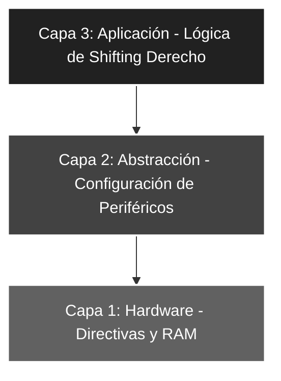

# 🚀 Elemental_08: Bit Shifting II (Desplazamiento a la Derecha y División)

## 🎯 Objetivos del Proyecto
* **Instrucción RRF:** Comprender el desplazamiento de bits hacia la derecha a través del registro de acarreo (*Carry*).
* **División por Software:** Implementar la lógica de división entera por 2 mediante el desplazamiento de bits.
* **Control de Inserción:** Aprender a forzar el bit de acarreo a '0' para garantizar que el bit más significativo (MSB) sea nulo tras la rotación.

---

## 📖 Teoría de Operación
En la arquitectura de 8 bits de Microchip, el desplazamiento a la derecha se realiza con la instrucción `RRF` (*Rotate Right f through Carry*). Esta operación desplaza todos los bits una posición a la derecha: el Bit 0 pasa al *Carry* y el valor previo del *Carry* ingresa por el Bit 7.

### 📝 Fundamentos de la Instrucción RRF
La lógica de movimiento de datos en este proyecto sigue este esquema:
$$C_{previo} \rightarrow [Bit 7 \dots Bit 0] \rightarrow C_{nuevo}$$


#### **Lógica de División Entera**
Desplazar un número binario una posición a la derecha es matemáticamente equivalente a realizar una **división por 2** (despreciando el resto). Para asegurar una división lógica pura:
1. **Clear Carry:** `BCF STATUS, C` asegura que el bit que ingresa por la izquierda sea siempre '0'.
2. **Rotación:** Al ejecutar `RRF Temp, W`, el valor original se reduce a la mitad.

**Ejemplo Práctico:**
Si ingresamos el valor decimal **10** (b'00001010'):
* **Estado Inicial:** `Temp = 00001010`, `Carry = 0` (forzado).
* **Ejecución RRF:** Los bits se desplazan a la derecha.
* **Resultado final en W:** `b'00000101'` (Decimal **5**).

---

## 🏗️ Arquitectura del Software (Modelo de 3 Capas)

El desarrollo mantiene la estructura jerárquica para garantizar la robustez del código:


#### 🔹 Detalle Capa 1: Hardware y Directivas

Definición de constantes y asignación del registro temporal en la memoria de propósito general (RAM).

```asm
;--- CAPA 1: DEFINICIÓN DE CONSTANTES Y RAM ---
ENTRADAS    EQU     b'00011111'    ; Configuración de RA0-RA4
MASCARASW   EQU     b'00011111'    ; Filtro de bits de entrada
Temp        EQU     0x0C           ; Registro Auxiliar en RAM (GPR)
```
#### 🔹 Detalle Capa 2: Configuración de Periféricos

Inicialización de los registros de dirección de datos y estabilización de las salidas.

```asm
;--- CAPA 2: CONFIGURACIÓN ---
INICIO
    BSF     STATUS, RP0     ; Acceso al Banco 1
    MOVLW   ENTRADAS
    MOVWF   TRISA           ; Puerto A como entrada
    CLRF    TRISB           ; Puerto B como salida
    BCF     STATUS, RP0     ; Regreso al Banco 0
    CLRF    PORTB           ; Asegura salidas en 0V al iniciar
```
#### 🔹 Detalle Capa 3: Lógica de Aplicación

Integración del borrado del Carry con la rotación para procesar la división.

```asm
;--- CAPA 3: LÓGICA DE APLICACIÓN ---
MAIN
    MOVF    PORTA, W        ; Captura entrada en W
    ANDLW   MASCARASW       ; Limpieza de bus (bits 5-7)
    MOVWF   Temp            ; Almacena en RAM para rotar
    BCF     STATUS, C       ; FORZADO: Asegura entrada de un '0' lógico
    RRF     Temp, W         ; Rotación a la derecha -> Resultado en W
    MOVWF   PORTB           ; Vuelca resultado a los LEDs
    GOTO    MAIN            ; Bucle infinito
```
### 🛠️ Detalles de Robustez
* **Control de Signo Lógico:** Al forzar el *Carry* a '0' mediante `BCF STATUS, C`, garantizamos que el desplazamiento sea de tipo **lógico** (ideal para números sin signo). Esto evita que bits residuales de operaciones anteriores "contaminen" el bit más significativo (MSB) tras la rotación.
* **Preservación de Datos:** El uso de un registro intermedio `Temp` en RAM permite que la rotación no destruya el dato original capturado en el puerto. Esto facilita expansiones futuras, como realizar múltiples operaciones sobre el mismo valor de entrada sin perder la referencia.
* **Determinismo (Anti-Jitter):** El flujo de ejecución es lineal y constante en cada ciclo del bucle `MAIN`. Al no existir saltos condicionales dependientes del valor del dato, se previene cualquier variación en el tiempo de respuesta (*jitter*), asegurando estabilidad visual en la salida.

---

### 🗺️ Mapeo de Hardware

| Periférico | Pin PIC16F84A | Configuración | Función |
| :--- | :--- | :--- | :--- |
| **Interruptores** | RA0 - RA4 | Entrada (Pull-down) | Valor binario base de entrada |
| **Carry Bit** | STATUS <0> | Software (Bit 0) | Inserción de bit '0' por izquierda |
| **LED Array** | RB0 - RB7 | Salida (Output) | Valor dividido entero ($n / 2$) |
| **Reset** | Pin 4 (MCLR) | Pull-up Externo | Reseteo físico del sistema |
| **Oscilador** | OSC1 / OSC2 | Modo XT (4 MHz) | Reloj maestro del sistema |

---

### 🎓 Conclusión
Este proyecto completa el estudio de los desplazamientos de bits en arquitectura de 8 bits. La instrucción `RRF` es la contraparte necesaria de `RLF`, permitiendo implementar operaciones aritméticas de división, decodificación de protocolos serie y manipulación de datos a nivel de bit con total precisión y control sobre el hardware.

---
🛠️ *Estudiante de Ing. Electrónica @UTN_FRT | Apasionado por los Sistemas Embebidos y el Low-level (ASM/C).*