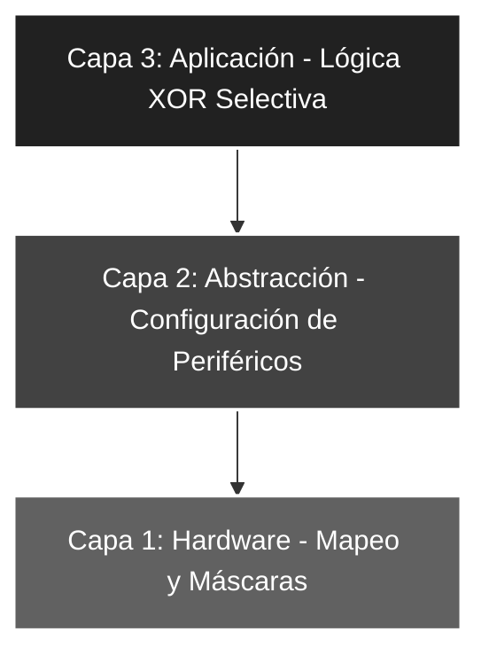

# 🚀 Elemental_09: Máscaras de Bits IV (Inversión Selectiva Par)

## 🎯 Objetivos del Proyecto
* **Inversión Condicional:** Utilizar la lógica XOR para invertir únicamente los bits en posiciones pares (0, 2, 4).
* **Transparencia Lógica:** Mantener la integridad de los bits impares de la entrada hacia la salida sin alteraciones.
* **Control de Bus:** Reforzar el filtrado de entradas físicas mediante máscaras AND antes del procesamiento lógico.

---

## 📖 Teoría de Operación
Este proyecto profundiza en la versatilidad de la compuerta XOR. Dependiendo del bit configurado en la máscara, la XOR puede actuar de dos formas distintas sobre el dato de entrada:

### 📝 Fundamentos de la Máscara XOR Selectiva
La operación `XORLW` procesa bit a bit el acumulador contra una constante literal. La clave reside en los dos estados posibles de la máscara:

#### **Lógica de Control de Bits**
1. **Paso Directo (Neutro):** Si el bit de la máscara es **0**, el resultado es igual al bit de entrada ($x \oplus 0 = x$).
2. **Inversión (Toggle):** Si el bit de la máscara es **1**, el resultado es el inverso del bit de entrada ($x \oplus 1 = \bar{x}$).


#### **Aplicación en el Proyecto**
Utilizamos la máscara `b'01010101'`. Esto produce el siguiente efecto:
* **Bits 0, 2, 4, 6:** Tienen un '1' en la máscara $\rightarrow$ Se **invierten**.
* **Bits 1, 3, 5, 7:** Tienen un '0' en la máscara $\rightarrow$ Se **mantienen**.

**Ejemplo Práctico:**
Si ingresamos por el Puerto A el valor decimal **10** (b'00001010'):
* **Entrada capturada:** `b'00001010'`
* **Máscara XOR:** `b'01010101'`
* **Resultado:** `b'01011111'` 
> *Nota: Observar cómo los bits en posiciones pares cambiaron su estado, mientras que los impares (como el bit 1 y el 3) permanecieron igual al valor de entrada.*

---

## 🏗️ Arquitectura del Software (Modelo de 3 Capas)

El desarrollo se organiza bajo una estructura jerárquica para asegurar la escalabilidad:


#### 🔹 Detalle Capa 1: Hardware y Directivas

Definición de las constantes de filtrado y la máscara de inversión intermitente (par).

```asm
;--- CAPA 1: DEFINICIÓN DE CONSTANTES ---
ENTRADAS     EQU    b'00011111'    ; RA0-RA4 como entradas
MASCARASW    EQU    b'00011111'    ; Filtro de seguridad (5 bits)
MASCARA_XOR  EQU    b'01010101'    ; Máscara para invertir bits pares (0,2,4,6)
```
#### 🔹 Detalle Capa 2: Configuración de Periféricos

Configuración de registros TRIS para establecer la dirección del flujo de datos.

```asm
;--- CAPA 2: CONFIGURACIÓN ---
INICIO
    BSF     STATUS, RP0     ; Acceso al Banco 1
    MOVLW   ENTRADAS
    MOVWF   TRISA           ; Configura entradas
    CLRF    TRISB           ; Puerto B como salida completa
    BCF     STATUS, RP0     ; Regreso al Banco 0
    CLRF    PORTB           ; Estado inicial seguro
```
### 🔹 Detalle Capa 3: Lógica de Aplicación

Procesamiento de los datos de entrada mediante la ALU aplicando la máscara de control.

```asm
;--- CAPA 3: LÓGICA DE APLICACIÓN ---
MAIN
    MOVF    PORTA, W        ; Lee PORTA y carga en W
    ANDLW   MASCARASW       ; Limpia bits no físicos (5, 6, 7)
    XORLW   MASCARA_XOR     ; Invierte selectivamente los bits pares
    MOVWF   PORTB           ; Vuelca el resultado al Puerto B
    GOTO    MAIN            ; Bucle infinito
```
### 🛠️ Detalles de Robustez
* **Eficiencia de Procesamiento:** La inversión selectiva se realiza en un **solo ciclo de instrucción** (1μs a 4MHz), lo que optimiza el uso de la CPU y evita el uso de condicionales `BTFSS` o saltos complejos que fragmentan el flujo del programa.
* **Seguridad de Datos:** La combinación secuencial de `ANDLW` (filtro) y `XORLW` (procesador) garantiza que el procesamiento lógico solo afecte a la información relevante del puerto, ignorando cualquier ruido en los pines no implementados.
* **Flexibilidad de Diseño:** El código es altamente paramétrico; simplemente cambiando un solo bit en la constante `MASCARA_XOR`, el comportamiento de todo el hardware se redefine sin necesidad de alterar la arquitectura del software.

---

### 🗺️ Mapeo de Hardware

| Periférico | Pin PIC16F84A | Configuración | Función |
| :--- | :--- | :--- | :--- |
| **Interruptores** | RA0 - RA4 | Entrada (Pull-down) | Captura de datos originales de entrada |
| **Lógica XOR** | Interna (ALU) | b'01010101' | Inversor selectivo (Solo bits pares) |
| **LED Array** | RB0 - RB7 | Salida (Output) | Visualización del resultado procesado |
| **Reset** | Pin 4 (MCLR) | Pull-up Externo | Reseteo físico del microcontrolador |
| **Oscilador** | OSC1 / OSC2 | Modo XT (4 MHz) | Reloj maestro del sistema |

---

### 🎓 Conclusión
Este proyecto demuestra cómo la lógica booleana permite el **control granular** de cada pin de salida de forma independiente. La técnica de inversión selectiva es vital en sistemas de control industrial y robótica, donde ciertos actuadores deben trabajar en lógica inversa respecto a otros, permitiendo una adaptación rápida y flexible entre los requerimientos del software y las limitantes del hardware.

---
🛠️ *Estudiante de Ing. Electrónica @UTN_FRT | Apasionado por los Sistemas Embebidos y el Low-level (ASM/C).*