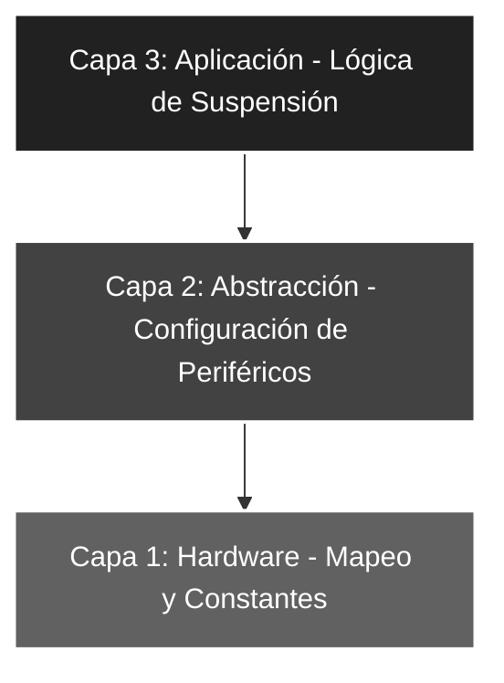

# 🚀 Elemental_10: Gestión de Energía (Instrucción SLEEP)

## 🎯 Objetivos del Proyecto
* **Modo de Bajo Consumo:** Comprender el funcionamiento de la instrucción `SLEEP` y cómo detiene el oscilador del sistema.
* **Ejecución Única:** Implementar un flujo de programa que realice una tarea de captura y visualización una sola vez antes de suspenderse.
* **Eficiencia Energética:** Introducir los conceptos de ahorro de corriente en sistemas embebidos.

---

## 📖 Teoría de Operación
La instrucción `SLEEP` coloca al PIC16F84A en modo de **reposo (Standby)**. Durante este estado, el oscilador principal se detiene, lo que reduce drásticamente el consumo de corriente (típicamente a valores de microamperios).

### 📝 Fundamentos de la Instrucción SLEEP
Al ejecutarse `SLEEP`, ocurren los siguientes eventos internos:
1. El oscilador del sistema se detiene.
2. El bit `PD` (Power Down) del registro `STATUS` se pone a '0'.
3. El bit `TO` (Time Out) del registro `STATUS` se pone a '1'.
4. El Watchdog Timer (si está activo) se pone a cero.


#### **Lógica de Ejecución Única**
A diferencia de los proyectos anteriores, el flujo no es cíclico:
* **Paso 1:** Se configuran los puertos.
* **Paso 2:** Se lee la entrada física y se procesa.
* **Paso 3:** Se congela el valor en la salida (`PORTB`).
* **Paso 4:** El micro entra en `SLEEP`. En este código, al no haber fuentes de "despertar" (*Wake-up*) configuradas (como interrupciones o Watchdog), el sistema queda en un estado de bajo consumo eterno hasta que ocurra un Reset físico.

---

## 🏗️ Arquitectura del Software (Modelo de 3 Capas)

El desarrollo se organiza bajo una estructura jerárquica para asegurar la robustez:


#### 🔹 Detalle Capa 1: Hardware y Directivas

Se definen las constantes para el manejo de los 5 bits de entrada del Puerto A.

```asm
;--- CAPA 1: DEFINICIÓN DE CONSTANTES ---
ENTRADAS     EQU    b'00011111'    ; RA0-RA4 como entradas
MASCARASW    EQU    b'00011111'    ; Filtro para asegurar los 5 bits útiles
```
#### 🔹 Detalle Capa 2: Configuración de Periféricos

Inicialización de los registros TRIS y limpieza de los latches de salida.

```asm
;--- CAPA 2: CONFIGURACIÓN ---
INICIO
    BSF     STATUS, RP0     ; Acceso al Banco 1
    MOVLW   ENTRADAS
    MOVWF   TRISA           ; Configura entradas
    CLRF    TRISB           ; Puerto B como salida completa
    BCF     STATUS, RP0     ; Regreso al Banco 0
    CLRF    PORTB           ; Asegura salidas en 0 al iniciar
```
#### 🔹 Detalle Capa 3: Lógica de Aplicación

En esta capa se ejecuta la acción principal y se ordena la detención del CPU. Se incluye un bucle de seguridad post-sleep.

```asm
;--- CAPA 3: LÓGICA DE APLICACIÓN ---
MAIN
    MOVF    PORTA, W        ; Captura el valor de los interruptores
    ANDLW   MASCARASW       ; Filtra ruido en bits 5-7
    MOVWF   PORTB           ; Muestra el resultado en los LEDs
    SLEEP                   ; Entra en modo Standby de bajo consumo
SEGURO
    GOTO    SEGURO          ; TRAMPA DE SEGURIDAD: Evita ejecución de basura
```
### 🛠️ Detalles de Robustez
* **Bucle de Seguridad (Trap):** Después de la instrucción `SLEEP`, se implementa un `GOTO SEGURO`. Esta es una **buena práctica de ingeniería** para evitar que el PC (*Program Counter*) continúe ejecutando "código basura" o NOPs en caso de un despertar inesperado por ruido o fallos en el oscilador.
* **Determinismo de Ciclo Único:** El sistema garantiza que la captura de datos sea única por cada ciclo de alimentación o Reset físico, lo cual es ideal para configuraciones de hardware que solo deben leerse al inicio (como Dip-switches de dirección).
* **Integridad de Salida (Persistence):** Los niveles lógicos en `PORTB` se mantienen estables incluso durante el estado de reposo absoluto, ya que los *latches* del puerto no se borran al entrar en bajo consumo, permitiendo que los LEDs (o actuadores) conserven su estado.

---

### 🗺️ Mapeo de Hardware

| Periférico | Pin PIC16F84A | Configuración | Función |
| :--- | :--- | :--- | :--- |
| **Interruptores** | RA0 - RA4 | Entrada (Pull-down) | Captura de configuración única inicial |
| **CPU Core** | Interno | Instrucción SLEEP | Detención del oscilador (Modo Standby) |
| **LED Array** | RB0 - RB7 | Salida (Output) | Visualización estática persistente |
| **Reset** | Pin 4 (MCLR) | Pulsador Externo | Despertar / Reiniciar el sistema físico |
| **Oscilador** | OSC1 / OSC2 | Modo XT (4 MHz) | Reloj maestro (Detenido en Sleep) |

---

### 🎓 Conclusión
Este proyecto introduce el concepto crítico de la **gestión de potencia**. En el diseño electrónico profesional, dominar el modo `SLEEP` marca la diferencia entre un producto que funciona meses con una batería y uno que se agota en pocas horas. Esta lógica es la base fundamental para los próximos laboratorios donde despertaremos al microcontrolador mediante eventos externos (Interrupciones).

---
🛠️ *Estudiante de Ing. Electrónica @UTN_FRT | Apasionado por los Sistemas Embebidos y el Low-level (ASM/C).*