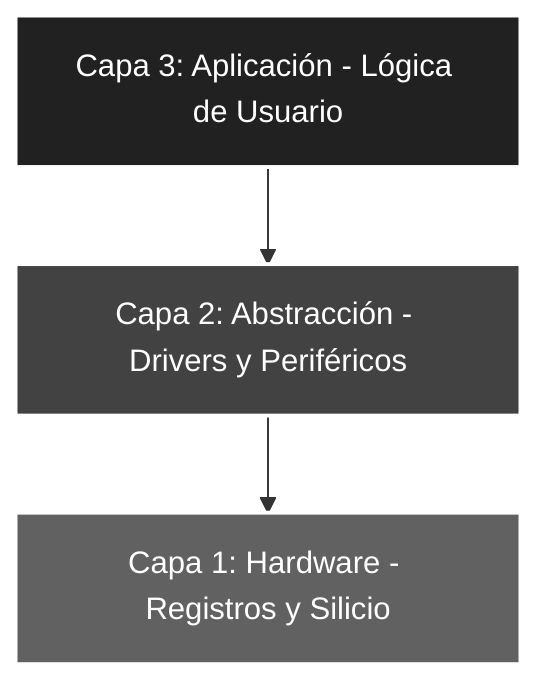

# 🚀 Ensam_01: Configuración de Salida y Visualización de Constante

## 🎯 Objetivos del Proyecto
* **Dominio de Bancos de Memoria:** Implementar la conmutación física entre el **Banco 0** (Datos) y el **Banco 1** (Configuración) mediante el bit `RP0` del registro `STATUS`.
* **Control de Flujo de Datos:** Configurar el registro de dirección `TRISB` para establecer el Puerto B como salida digital.
* **Transferencia de Literales:** Utilizar el registro de trabajo `W` (Acumulador) para mover constantes desde la memoria de programa hacia los pines físicos.

---

## 📖 Teoría de Operación
En la arquitectura Harvard del **PIC16F84A**, la memoria de datos se organiza en **Bancos** para optimizar el direccionamiento de 7 bits. Para configurar la dirección de un puerto (Entrada o Salida), se debe acceder al registro `TRIS` ubicado en el **Banco 1**, mientras que para manipular los niveles lógicos se utiliza el registro `PORT` en el **Banco 0**.

---

### 📝 Fundamentos del Registro STATUS (Bit RP0)
El bit `RP0` (*Register Bank Select*) del registro `STATUS` (ubicado en la dirección `03h`) actúa como el conmutador maestro de la memoria:
* **`STATUS, RP0 = 1`**: El microcontrolador apunta al **Banco 1** (Configuración de periféricos: `TRISA`, `TRISB`, `OPTION_REG`).
* **`STATUS, RP0 = 0`**: El microcontrolador apunta al **Banco 0** (Operación de datos: `PORTA`, `PORTB`, RAM GPR).

#### **Lógica de Configuración de Puertos**
El ejercicio implementa el ciclo crítico de inicialización de hardware:
1. **Acceso (BSF):** Se pone a '1' el bit `RP0` para saltar al Banco 1.
2. **Direccionamiento:** Se carga un valor en `W` y se vuelca en `TRISB` (0 = Salida, 1 = Entrada).
3. **Retorno (BCF):** Se pone a '0' el bit `RP0` para volver al Banco 0 y permitir el flujo de datos.
4. **Ejecución:** Se escribe la constante deseada en el registro `PORTB` para activar los pines físicos.

**Ejemplo Práctico en el Proyecto:**
Para encender un LED en el pin RB0:
* **En Banco 1:** Se limpia `TRISB` (`CLRF TRISB`) para que todo el puerto sea salida.
* **En Banco 0:** Se carga `b'00000001'` en el acumulador y se mueve a `PORTB`.

> **Nota de Robustez:** Olvidar el retorno al Banco 0 (`BCF STATUS, RP0`) es uno de los errores más comunes en ASM, ya que el programa intentará escribir datos de usuario en registros de configuración, provocando un comportamiento errático del hardware.

---

## 🏗️ Arquitectura del Software (Modelo de 3 Capas)

El desarrollo se organiza bajo una estructura jerárquica para asegurar la escalabilidad y facilitar el mantenimiento del código:



#### 🔹 Detalle Capa 1: Hardware y Directivas
Se definen los parámetros críticos del silicio, la configuración de los *fuses* y la constante de usuario.

```asm
;--- CAPA 1: DEFINICIÓN DE CONSTANTES ---
CONSTANTE   EQU     b'01010101' ; Valor binario a visualizar en los LEDs
```

#### 🔹 Detalle Capa 2: Configuración de Periféricos
Gestión técnica de la dirección de datos mediante la manipulación del registro `STATUS` para la conmutación de bancos de memoria.

```asm
;--- CAPA 2: CONFIGURACIÓN ---
Inicio      
    bsf     STATUS, RP0  ; Selección de Banco 1 (Acceso a registros TRIS)
    clrf    TRISB        ; Configura todas las líneas de Puerto B como SALIDA (0)
    bcf     STATUS, RP0  ; Retorno a Banco 0 (Acceso a registros PORT)
```

#### 🔹 Detalle Capa 3: Lógica de Aplicación
Integración de funciones y lógica de control para el despliegue de datos en tiempo real.

```asm
;--- CAPA 3: LÓGICA ---
Principal
    movlw   CONSTANTE    ; Carga el valor en el acumulador W
    movwf   PORTB        ; Transfiere el contenido de W al puerto de salida
    goto    Principal    ; Bucle cerrado infinito para mantener el estado
```

### 🛠️ Detalles de Robustez
* **Vector de Interrupción:** Se implementa un `ORG 04h` con la instrucción `RETFIE` como medida de seguridad perimetral del software, evitando ejecuciones erráticas ante saltos inesperados a la memoria de programa de interrupción.
* **Configuración de Fuses:**
    * `_PWRTE_ON`: Asegura un retardo de encendido (*Power-up Timer*) para permitir que el **VCC** se estabilice antes de iniciar la ejecución del código.
    * `_WDTE_OFF`: Desactiva el perro guardián (*Watchdog Timer*) para evitar reinicios cíclicos no deseados en este flujo de control simple.

---

### 🗺️ Mapeo de Hardware

| Periférico | Pin PIC16F84A | Configuración | Función |
| :--- | :--- | :--- | :--- |
| **LED Array** | RB0 - RB7 | Salida (Output) | Visualización binaria de datos |
| **Reset** | Pin 4 (MCLR) | Pull-up Externo | Reseteo físico del sistema |
| **Cristal** | OSC1 / OSC2 | Modo XT (4 MHz) | Fuente de reloj del sistema |

---

### 🎓 Conclusión
Este proyecto establece la base fundamental de la programación en **Assembler** para Microchip. El dominio de la segmentación de bancos es el pilar técnico que permite abordar periféricos más complejos como **Timers**, **EEPROM** o **conversores ADC** en arquitecturas superiores, garantizando un control total sobre el hardware.

---
🛠️ *Estudiante de Ing. Electrónica @UTN_FRT | Apasionado por los Sistemas Embebidos y el Low-level (ASM/C).*