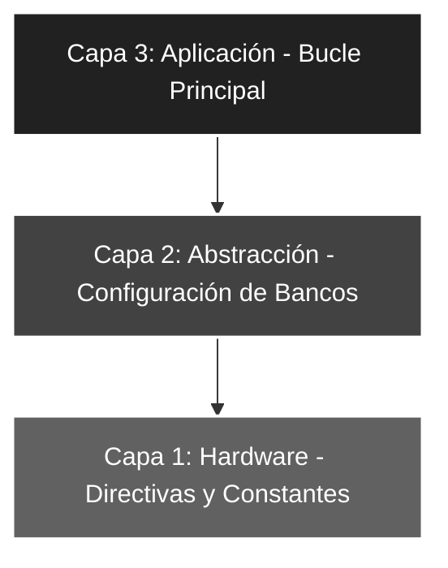

# 🚀 Ensam_02: Configuración de Salida y Gestión de Nibbles

## 🎯 Objetivos del Proyecto
* **Segmentación de Puertos:** Aprender a manipular el **Puerto B** dividiéndolo lógicamente en dos grupos de 4 bits (Nibbles).
* **Control de Estado Lógico:** Establecer estados diferenciados (Alto/Bajo) de forma simultánea en un único puerto de salida.
* **Consolidación de Bancos:** Reforzar la técnica de conmutación entre el Banco 1 (Configuración) y el Banco 0 (Operación).

---

## 📖 Teoría de Operación
En sistemas digitales, un **Nibble** representa la mitad de un byte (4 bits). Este ejercicio es fundamental para el desarrollo de drivers de periféricos que utilizan buses de datos de 4 bits, como los displays LCD 16x2 en modo comando o teclados matriciales.

El programa carga una constante binaria `b'11110000'` en el acumulador **W**, la cual apaga los 4 bits menos significativos (LSB) y enciende los 4 bits más significativos (MSB) del Puerto B.

---

## 🏗️ Arquitectura del Software (Modelo de 3 Capas)

El desarrollo se organiza bajo una estructura jerárquica para asegurar la escalabilidad y facilitar el mantenimiento del código:


#### 🔹 Detalle Capa 1: Hardware y Directivas
Se definen los parámetros críticos del silicio y la constante que segmenta el puerto en dos nibbles diferenciados para el control de bits independientes.

```asm
;--- CAPA 1: DEFINICIÓN DE CONSTANTES ---
CONSTANTE   EQU     b'11110000' ; Nibble alto en '1', nibble bajo en '0'
```
#### 🔹 Detalle Capa 2: Configuración de Periféricos
Gestión técnica de la dirección de datos mediante la manipulación del registro `STATUS` para conmutar al **Banco 1** y establecer la dirección del bus.

```asm
;--- CAPA 2: CONFIGURACIÓN ---
INICIO      
    bsf     STATUS, RP0  ; Acceso al Banco 1 (Configuración de registros TRIS)
    clrf    TRISB        ; Todo el Puerto B configurado como SALIDA (0)
    bcf     STATUS, RP0  ; Retorno al Banco 0 (Operación de registros PORT)
    
    movlw   CONSTANTE    ; Carga el patrón de bits en el registro de trabajo W
```

#### 🔹 Detalle Capa 3: Lógica de Aplicación
Integración de funciones y bucle de control infinito para asegurar la persistencia del estado lógico en los pines físicos del microcontrolador.

```asm
;--- CAPA 3: LÓGICA DE APLICACIÓN ---
MAIN
    movwf   PORTB        ; Transfiere el patrón del nibble alto/bajo a los pines físicos
    goto    MAIN         ; Bucle cerrado infinito de refresco
```

### 🛠️ Detalles de Robustez
* **Legibilidad Binaria:** El uso de constantes en formato binario (`b'...'`) permite una correspondencia directa "uno a uno" con los LEDs físicos, facilitando el proceso de depuración (*debugging*) y auditoría visual del hardware.
* **Vector de Seguridad:** Se implementa un `ORG 04h` con la instrucción `RETFIE` para asegurar que el sistema no colapse ante una interrupción accidental no configurada, retornando el control al programa principal.
* **Configuración de Fuses:**
    * `_WDTE_OFF`: Desactiva el *Watchdog Timer* para evitar reinicios por desbordamiento en el bucle infinito de la aplicación.
    * `_PWRTE_OFF`: Se mantiene desactivado para permitir un inicio inmediato tras la liberación del reset.

---

### 🗺️ Mapeo de Hardware

| Periférico | Pin PIC16F84A | Estado Lógico | Función |
| :--- | :--- | :--- | :--- |
| **LEDs (7-4)** | RB7 - RB4 | Nivel Alto (5V) | Nibble Superior Encendido |
| **LEDs (3-0)** | RB3 - RB0 | Nivel Bajo (0V) | Nibble Inferior Apagado |
| **Reset** | Pin 4 (MCLR) | Pull-up Ext. | Reseteo físico del sistema |
| **Oscilador** | OSC1 / OSC2 | XT (4 MHz) | Fuente de reloj del sistema |

---

### 🎓 Conclusión
Este proyecto demuestra la capacidad del **PIC16F84A** para gestionar grupos de bits de forma independiente dentro de un mismo registro. El dominio de la manipulación de nibbles es una técnica esencial para optimizar el uso de pines en proyectos de mayor complejidad técnica, como la implementación de buses de datos para periféricos externos.

---
🛠️ *Estudiante de Ing. Electrónica @UTN_FRT | Apasionado por los Sistemas Embebidos y el Low-level (ASM/C).*