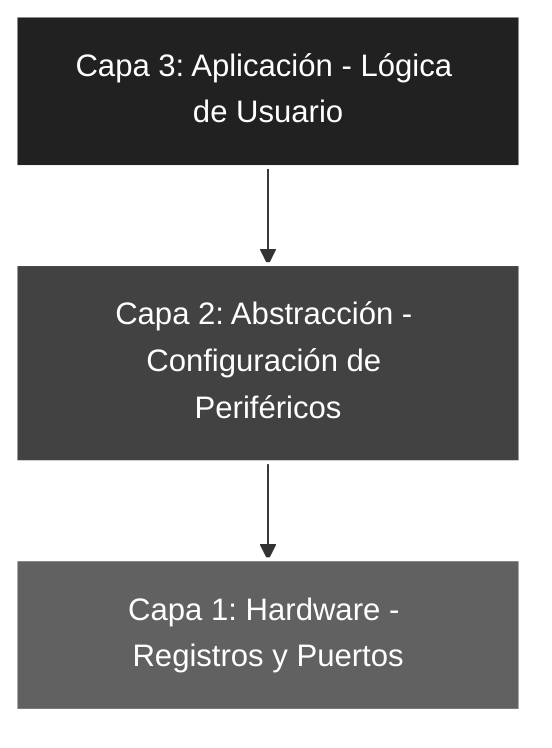

# 🚀 Ensam_03: Configuración de Entradas y Salidas (I/O)

## 🎯 Objetivos del Proyecto
* **Lectura de Periféricos:** Implementar la captura de estados lógicos externos a través del **Puerto A**.
* **Reflejo de Datos (Mirroring):** Vincular el flujo de datos de entrada directamente hacia un puerto de salida (**Puerto B**).
* **Configuración Mixta:** Gestionar registros `TRISA` y `TRISB` de forma simultánea en el Banco 1.

---

## 📖 Teoría de Operación
Este proyecto introduce el concepto de **interacción en tiempo real**. El microcontrolador actúa como un puente transparente: lee el estado de los interruptores conectados al Puerto A (RA0-RA4) y los despliega en el array de LEDs del Puerto B (RB0-RB4). 

Dado que el **PIC16F84A** posee resistencias de Pull-down en las entradas, se utiliza una lógica directa donde un nivel alto (5V) en la entrada activa la salida correspondiente.

---

## 🏗️ Arquitectura del Software (Modelo de 3 Capas)

El desarrollo se organiza bajo una estructura jerárquica para asegurar la escalabilidad y facilitar el mantenimiento del código:


#### 🔹 Detalle Capa 1: Hardware y Directivas
Se define la máscara de bits necesaria para configurar los 5 pines disponibles en el Puerto A, estableciendo la dirección de datos para los registros de configuración.

```asm
;--- CAPA 1: DEFINICIÓN DE CONSTANTES ---
ENTRADAS   EQU     b'00011111' ; Define los pines RA<4:0> como entradas
```
#### 🔹 Detalle Capa 2: Configuración de Periféricos
Gestión técnica de la dirección de datos bidireccional. Se establecen los registros de dirección `TRIS` accediendo al **Banco 1** de la memoria de datos.

```asm
;--- CAPA 2: CONFIGURACIÓN ---
INICIO      
    bsf     STATUS, RP0  ; Acceso al Banco 1 (Configuración de TRIS)
    clrf    TRISB        ; Puerto B configurado íntegramente como SALIDA (0)
    movlw   ENTRADAS     ; Carga la máscara de configuración en W
    movwf   TRISA        ; Establece RA<4:0> como entradas (1)
    bcf     STATUS, RP0  ; Retorno al Banco 0 (Operación de registros PORT)
```

#### 🔹 Detalle Capa 3: Lógica de Aplicación
Integración de funciones para el muestreo constante (*sampling*) de los pines de entrada y la actualización inmediata de los actuadores de salida.

```asm
;--- CAPA 3: LÓGICA DE APLICACIÓN ---
MAIN    
    movf    PORTA, W     ; Captura el estado de los interruptores en el registro W
    movwf   PORTB        ; Vuelca el estado capturado en el array de LEDs (RB0-RB4)
    goto    MAIN         ; Bucle cerrado infinito de muestreo (Sampling)
```
### 🛠️ Detalles de Robustez
* **Determinismo Temporal:** Al prescindir de retardos por software (*delays*), la latencia entre la activación física del interruptor y la respuesta del LED es mínima, limitada únicamente por unos pocos ciclos de instrucción.
* **Arquitectura Harvard:** Se explota el uso del registro de trabajo **W** como intermediario seguro, garantizando una transferencia de datos limpia entre puertos y evitando conflictos de bus.
* **Vector de Seguridad:** Se implementa un `ORG 04h` con la instrucción `RETFIE` para blindar el flujo de ejecución del programa ante saltos de memoria accidentales o ruidos electromagnéticos.

---

### 🗺️ Mapeo de Hardware

| Periférico | Pin PIC16F84A | Configuración | Función |
| :--- | :--- | :--- | :--- |
| **Interruptores** | RA0 - RA4 | Entrada (Pull-down) | Captura de datos de usuario |
| **LED Array** | RB0 - RB4 | Salida (Output) | Reflejo visual de la entrada |
| **Reset** | Pin 4 (MCLR) | Pull-up Externo | Reseteo físico del sistema |
| **Oscilador** | OSC1 / OSC2 | Modo XT (4 MHz) | Fuente de reloj del sistema |

---

### 🎓 Conclusión
Este proyecto implementa un sistema básico de **muestreo y respuesta (Sampling)**. Representa el pilar fundamental para cualquier sistema de control embebido donde el microcontrolador deba monitorear sensores digitales y actuar sobre actuadores de salida en tiempo real con mínima latencia.

---
🛠️ *Estudiante de Ing. Electrónica @UTN_FRT | Apasionado por los Sistemas Embebidos y el Low-level (ASM/C).*