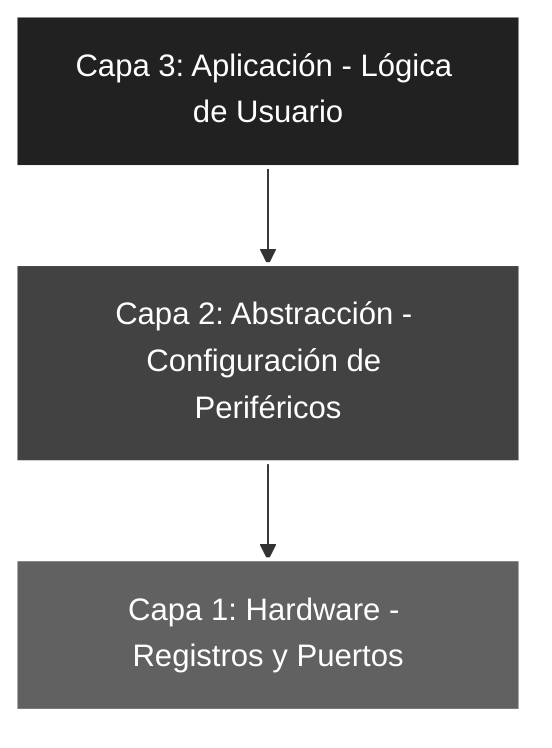

# 🚀 Ensam_03: Configuración de Entradas y Salidas (I/O)

## 🎯 Objetivos del Proyecto
* **Lectura de Periféricos:** Implementar la captura de estados lógicos externos a través del **Puerto A**.
* **Reflejo de Datos (Mirroring):** Vincular el flujo de datos de entrada directamente hacia un puerto de salida (**Puerto B**).
* **Configuración Mixta:** Gestionar registros `TRISA` y `TRISB` de forma simultánea en el Banco 1.

---

## 📖 Teoría de Operación
Este proyecto introduce el concepto de **interacción en tiempo real** mediante la creación de un puente lógico transparente entre los periféricos de entrada y salida. El microcontrolador actúa como un repetidor de estados, procesando la información de los interruptores para comandar el array de LEDs.

---

### 📝 Configuración de Entradas: El Registro TRIS
Para que un pin funcione como entrada, el microcontrolador debe configurar su etapa de salida en **Alta Impedancia (Hi-Z)**. Esto se logra mediante el registro **TRIS** (*Tri-State*), que actúa como el conmutador maestro de la dirección de datos en cada puerto.

#### **Lógica del bit TRIS**
El estado de cada bit en el registro `TRIS` determina el comportamiento físico y eléctrico del pin correspondiente:

* **Bit = 1 (Input):** El pin se configura como una entrada de alta impedancia. El circuito de excitación interno se "desconecta" lógicamente, permitiendo que las tensiones externas (sensores, pulsadores) sean leídas sin interferencia del microcontrolador.
* **Bit = 0 (Output):** El pin se configura como una salida activa (**Push-Pull**), permitiendo que el microcontrolador entregue corriente (VCC) o la absorba (GND) para controlar periféricos como LEDs, optoacopladores o transistores.

> **💡 Regla Mnemotécnica:** Para recordar la configuración de forma rápida en ASM, asociamos el número con la inicial de su función en inglés:
> * **1** $\rightarrow$ **I** (*Input*)
> * **0** $\rightarrow$ **O** (*Output*)

---

### 📝 Fundamentos de la Transferencia Directa (Mirroring)
En sistemas embebidos, el *Mirroring* es la técnica de replicar el estado de un registro de entrada (`PORTA`) en uno de salida (`PORTB`). Para que esta transferencia sea exitosa, ambos puertos deben estar sincronizados mediante el acumulador **W**, que sirve como vehículo de datos.

#### **Lógica de Entrada y Pull-Down**
Para garantizar estados lógicos definidos, el **PIC16F84A** requiere una referencia de tensión clara:
* **Estado de Reposo (0):** Las resistencias de **Pull-down** externas aseguran que el pin esté a 0V cuando el interruptor está abierto.
* **Estado Activo (1):** Al cerrar el interruptor, se inyectan 5V (VCC) al pin, superando el umbral de conmutación lógica.

#### **Flujo de Datos en el Programa**
El microcontrolador ejecuta un ciclo infinito de tres pasos críticos:
1. **Lectura:** Se captura el estado físico de los pines RA0-RA4 y se guarda en el acumulador.
2. **Puente:** El acumulador mantiene el dato de forma volátil.
3. **Escritura:** Se vuelca el contenido del acumulador hacia los pines RB0-RB4.

**Efecto Físico en el Hardware:**
Existe una relación biunívoca (1 a 1) entre la entrada y la salida. Si el interruptor en RA2 se cierra, el LED en RB2 se enciende instantáneamente, demostrando el determinismo del código ASM.

> **Nota Técnica:** Aunque parece una tarea simple, este proyecto valida la correcta configuración de los registros `TRIS` y la integridad eléctrica de las conexiones en la placa de desarrollo (EDUCIAA o similar).

---

## 🏗️ Arquitectura del Software (Modelo de 3 Capas)

El desarrollo se organiza bajo una estructura jerárquica para asegurar la escalabilidad y facilitar el mantenimiento del código:


#### 🔹 Detalle Capa 1: Hardware y Directivas
Se define la máscara de bits necesaria para configurar los 5 pines disponibles en el Puerto A, estableciendo la dirección de datos para los registros de configuración.

```asm
;--- CAPA 1: DEFINICIÓN DE CONSTANTES ---
ENTRADAS   EQU     b'00011111' ; Define los pines RA<4:0> como entradas
```
#### 🔹 Detalle Capa 2: Configuración de Periféricos
Gestión técnica de la dirección de datos bidireccional. Se establecen los registros de dirección `TRIS` accediendo al **Banco 1** de la memoria de datos.

```asm
;--- CAPA 2: CONFIGURACIÓN ---
INICIO      
    bsf     STATUS, RP0  ; Acceso al Banco 1 (Configuración de TRIS)
    clrf    TRISB        ; Puerto B configurado íntegramente como SALIDA (0)
    movlw   ENTRADAS     ; Carga la máscara de configuración en W
    movwf   TRISA        ; Establece RA<4:0> como entradas (1)
    bcf     STATUS, RP0  ; Retorno al Banco 0 (Operación de registros PORT)
```

#### 🔹 Detalle Capa 3: Lógica de Aplicación
Integración de funciones para el muestreo constante (*sampling*) de los pines de entrada y la actualización inmediata de los actuadores de salida.

```asm
;--- CAPA 3: LÓGICA DE APLICACIÓN ---
MAIN    
    movf    PORTA, W     ; Captura el estado de los interruptores en el registro W
    movwf   PORTB        ; Vuelca el estado capturado en el array de LEDs (RB0-RB4)
    goto    MAIN         ; Bucle cerrado infinito de muestreo (Sampling)
```
### 🛠️ Detalles de Robustez
* **Determinismo Temporal:** Al prescindir de retardos por software (*delays*), la latencia entre la activación física del interruptor y la respuesta del LED es mínima, limitada únicamente por unos pocos ciclos de instrucción.
* **Arquitectura Harvard:** Se explota el uso del registro de trabajo **W** como intermediario seguro, garantizando una transferencia de datos limpia entre puertos y evitando conflictos de bus.
* **Vector de Seguridad:** Se implementa un `ORG 04h` con la instrucción `RETFIE` para blindar el flujo de ejecución del programa ante saltos de memoria accidentales o ruidos electromagnéticos.

---

### 🗺️ Mapeo de Hardware

| Periférico | Pin PIC16F84A | Configuración | Función |
| :--- | :--- | :--- | :--- |
| **Interruptores** | RA0 - RA4 | Entrada (Pull-down) | Captura de datos de usuario |
| **LED Array** | RB0 - RB4 | Salida (Output) | Reflejo visual de la entrada |
| **Reset** | Pin 4 (MCLR) | Pull-up Externo | Reseteo físico del sistema |
| **Oscilador** | OSC1 / OSC2 | Modo XT (4 MHz) | Fuente de reloj del sistema |

---

### 🎓 Conclusión
Este proyecto implementa un sistema básico de **muestreo y respuesta (Sampling)**. Representa el pilar fundamental para cualquier sistema de control embebido donde el microcontrolador deba monitorear sensores digitales y actuar sobre actuadores de salida en tiempo real con mínima latencia.

---
🛠️ *Estudiante de Ing. Electrónica @UTN_FRT | Apasionado por los Sistemas Embebidos y el Low-level (ASM/C).*