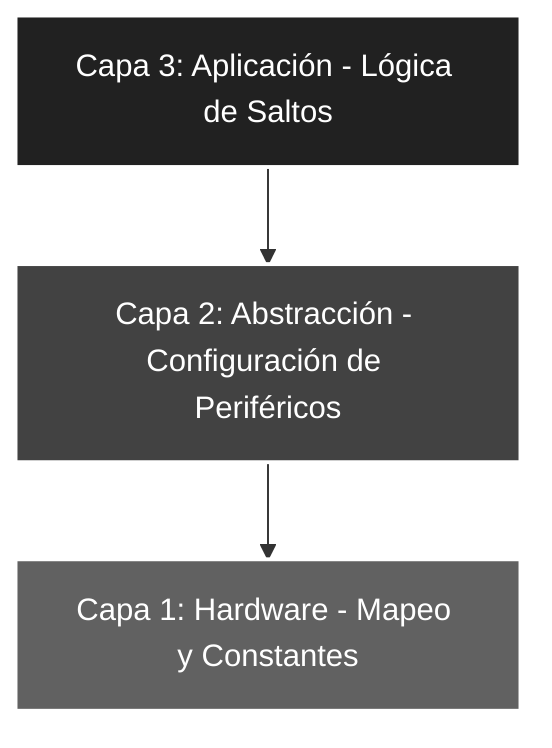

# 🚀 Saltos_01: Control de Flujo y Bifurcación (Skip Logic)

## 🎯 Objetivos del Proyecto
* **Saltos Condicionales:** Comprender y aplicar las instrucciones de testeo de bits (`BTFSC` / `BTFSS`) para la toma de decisiones en tiempo real.
* **Lógica de Bifurcación:** Implementar estructuras de control excluyentes (`If-Else`) en lenguaje ensamblador puro.
* **Arquitectura Robusta:** Consolidar el modelo de 3 capas para separar la configuración del hardware de la lógica de aplicación.

---

## 📖 Teoría de Operación
En la arquitectura RISC de 8 bits de Microchip, la toma de decisiones no se basa en comparadores complejos, sino en el testeo de bits individuales mediante las instrucciones **`BTFSC`** (*Bit Test f, Skip if Clear*) y **`BTFSS`** (*Bit Test f, Skip if Set*). Estas instrucciones evalúan el estado de un bit en un registro y determinan si el flujo del programa debe continuar de forma lineal o saltar la instrucción inmediata superior.

### 📝 Fundamentos de las Instrucciones de Salto (Skip)
La lógica de ejecución condicional en este proyecto sigue este esquema técnico:

1. **Evaluación del Bit:** El CPU inspecciona el bit $n$ del registro $f$.
2. **Acción de Salto:** - **BTFSC:** Salta la siguiente instrucción si el bit evaluado es **'0'**.
   - **BTFSS:** Salta la siguiente instrucción si el bit evaluado es **'1'**.

#### **Mecánica del Program Counter (PC)**
Matemáticamente, el salto se traduce en una manipulación directa del registro **PC** (Contador de Programa) durante el ciclo de ejecución de la instrucción:

* **Si la condición es Falsa (No salta):** $PC = PC + 1$ (Ejecución lineal de 1 ciclo).
* **Si la condición es Verdadera (Salta):** $PC = PC + 2$ (El CPU descarta la instrucción siguiente y la reemplaza por un `NOP` interno, consumiendo 2 ciclos).


**Ejemplo Práctico (Pull-Down):**
Si deseamos detectar la presión de un pulsador en **RA0** (Presionado = '1'):
* **Estado Reposo (RA0 = 0):** Ejecutamos `BTFSS PORTA, 0`. La condición *Set* (1) es **Falsa**. El micro **NO SALTA** y ejecuta la línea siguiente (un `GOTO` a la rama alternativa).
* **Estado Activo (RA0 = 1):** Ejecutamos `BTFSS PORTA, 0`. La condición *Set* (1) es **Verdadera**. El micro **SALTA** la línea siguiente, ingresando directamente a la subrutina de activación.


---

## 🏗️ Arquitectura del Software (Modelo de 3 Capas)

El desarrollo se organiza bajo una estructura jerárquica para asegurar la escalabilidad y facilitar el mantenimiento del código:


#### 🔹 Detalle Capa 1: Hardware y Directivas

Uso de **#DEFINE** y directivas **EQU** para garantizar la legibilidad y facilitar la migración de pines.

```asm
#DEFINE SW_ENTRADA  PORTA,0     ; Definición del switch de control
ENTRADA     EQU     b'00000001' ; Máscara para TRISA (RA0 entrada)
LED_ON_1    EQU     b'01010101' ; Patrón binario para RA0 = 1
LED_ON_2    EQU     b'10101010' ; Patrón binario para RA0 = 0
```
#### 🔹 Detalle Capa 2: Configuración de Periféricos

Inicialización de registros de dirección (TRIS) y limpieza de los latches de salida.

```asm
CONFIG_PERIF
    BSF     STATUS, RP0    ; Acceso al Banco 1
    MOVLW   ENTRADA
    MOVWF   TRISA          ; Configura RA0 como entrada
    CLRF    TRISB          ; Puerto B como salida completa
    BCF     STATUS, RP0    ; Regreso al Banco 0
    CLRF    PORTB          ; Asegura salidas en 0 al iniciar
    CLRF    PORTA          ; Limpieza de buffers de entrada
```
#### 🔹 Detalle Capa 3: Lógica de Aplicación

Bucle principal que evalúa dinámicamente la entrada y bifurca el flujo hacia etiquetas excluyentes.

```asm
MAIN
    BTFSS   SW_ENTRADA    ; ¿Switch en 1? (Skip if Set)
    goto    MODO_ELSE     ; Rama para RA0 = 0
MODO_IF                   ; Rama para RA0 = 1
    MOVLW   LED_ON_1
    MOVWF   PORTB
    goto    MAIN          ; Re-testeo cíclico
MODO_ELSE
    MOVLW   LED_ON_2
    MOVWF   PORTB
    goto    MAIN
```
---

### 🛠️ Detalles de Robustez
* **Saltos Excluyentes:** La inclusión de `goto MAIN` al final de cada rama (`MODO_IF` y `MODO_ELSE`) garantiza que el programa nunca "caiga" accidentalmente en el bloque de código siguiente, manteniendo el determinismo del sistema.
* **Higiene de Registros:** El comando `CLRF PORTA` previene lecturas erróneas por estados residuales o ruidos en los buffers de entrada tras un encendido (*Power-on*) o un Reset físico.
* **Determinismo Temporal:** Se ha verificado que la lógica de salto condicional es la forma más eficiente de gestionar I/O por sondeo (*Polling*) en arquitecturas RISC, minimizando la latencia de respuesta.

---

### 🗺️ Mapeo de Hardware

| Periférico | Pin PIC16F84A | Configuración | Función |
| :--- | :--- | :--- | :--- |
| **Switch** | RA0 (Pin 17) | Entrada (Pull-down) | Selector de modo de visualización |
| **LED Array** | RB0 - RB7 | Salida (Push-pull) | Visualización de patrones binarios |
| **VCC/GND** | Pines 14 y 5 | Alimentación | 5.0V Estabilizados |

---

### 🎓 Conclusión
Este laboratorio demuestra que el control de flujo en bajo nivel requiere una planificación rigurosa del **Program Counter**. La transición de una ejecución lineal a una bifurcada es el paso fundamental para construir sistemas reactivos. Al aplicar una estructura por capas, el código resultante es profesional, fácil de depurar y está listo para integrarse en sistemas de control industrial más complejos, donde el tiempo de respuesta y la previsibilidad son críticos.

---
🛠️ *Estudiante de Ing. Electrónica @UTN_FRT | Apasionado por los Sistemas Embebidos y el Low-level (ASM/C).*