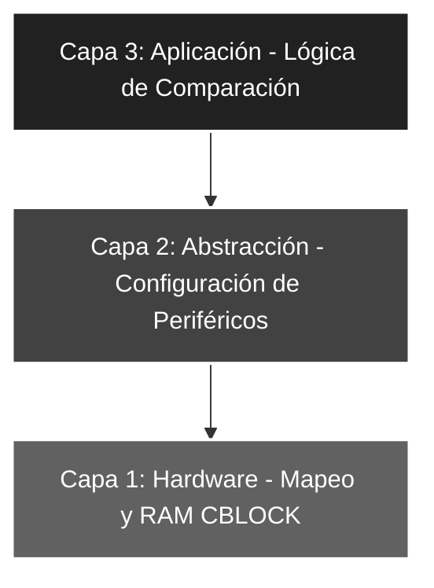

# 🚀 Saltos_02: Comparación de Registros y Manejo de Banderas (Flags)

## 🎯 Objetivos del Proyecto
* **Comparación Lógica:** Implementar la operación de igualdad (`==`) mediante la sustracción aritmética de registros.
* **Uso del Registro STATUS:** Comprender el funcionamiento del bit **Z (Zero)** como indicador de resultado nulo en la ALU.
* **Gestión de RAM:** Utilizar bloques de memoria de usuario (`CBLOCK`) para el almacenamiento de variables temporales.
* **Lógica de Bifurcación:** Dominar el uso de `BTFSS` y `BTFSC` para el control de flujo dinámico.

---

## 📖 Teoría de Operación
En el PIC16F84A, no existe una instrucción `COMPARE` directa. La comparación de dos valores se realiza mediante una sustracción aritmética. El resultado de esta operación no nos interesa por su valor numérico, sino por el efecto que produce en las **banderas de estado** del microcontrolador.

### 📝 Fundamentos de la Comparación por Resta
La lógica de igualdad en este proyecto sigue el esquema de la operación `SUBWF`:

$$Resultado = f (Dato) - W (Constante)$$


#### **El Bit Z (Zero) del Registro STATUS**
El bit **Z** es una bandera (flag) que se activa automáticamente según el resultado de la última operación aritmética o lógica:
1. **Si Resultado ≠ 0:** El bit **Z** se mantiene en **'0'**.
2. **Si Resultado = 0:** El bit **Z** se pone en **'1'** (Set).

### 🔀 Instrucciones de Testeo: BTFSS vs BTFSC
Para evaluar el bit **Z** (o cualquier otro bit), disponemos de dos herramientas de salto condicional (*Skip Logic*):

* **BTFSS (Bit Test f, Skip if Set):** Salta la siguiente instrucción si el bit es **'1'**. Es la opción lógica para preguntar: *"¿El resultado fue cero?"* (Si $Z=1$, salta a la rutina de igualdad).
* **BTFSC (Bit Test f, Skip if Clear):** Salta la siguiente instrucción si el bit es **'0'**. Es ideal para lógicas inversas o para preguntar: *"¿El resultado NO fue cero?"*.


**Ejemplo Práctico:**
Si deseamos comparar si el valor ingresado por el **PORTA** es igual a **.16**:
* **Paso 1:** Cargamos $W = .16$.
* **Paso 2:** Ejecutamos `SUBWF VALOR_LEIDO, W`.
* **Escenario A (PORTA = 10):** $10 - 16 = -6$. Como el resultado NO es cero, $Z = 0$. La instrucción `BTFSS STATUS, Z` **NO SALTA** y el programa bifurca a la rama de "Distintos".
* **Escenario B (PORTA = 16):** $16 - 16 = 0$. Como el resultado ES cero, $Z = 1$. La instrucción `BTFSS STATUS, Z` **SALTA** la siguiente línea y el programa identifica que son **Iguales**.

---

## 🏗️ Arquitectura del Software (Modelo de 3 Capas)

El desarrollo se organiza bajo una estructura jerárquica para asegurar la robustez y el orden en la memoria RAM:


#### 🔹 Detalle Capa 1: Hardware y RAM

Se utiliza la directiva **CBLOCK** para *asignar direcciones de memoria* de forma dinámica a partir de la **dirección 0x0C**.

```asm
    CBLOCK  0x0C        ; Inicio de RAM GPR
        VALOR_LEIDO     ; Registro para captura de PORTA
        AUXILIAR        ; Registro para procesos intermedios
    ENDC

NUMERO      EQU     .16 ; Constante de comparación
LED_ON_1    EQU     b'11111111' ; Todos ON (Iguales)
LED_ON_2    EQU     b'01010101' ; Intercalados (Distintos)
```
#### 🔹 Detalle Capa 2: Configuración de Periféricos

Configuración de TRISA como entrada (5 bits) y TRISB como salida, asegurando la limpieza de los latches.

```asm
CONFIG_PERIF
    BSF     STATUS, RP0    ; Banco 1
    MOVLW   b'00011111'    ; RA<4:0> como entrada
    MOVWF   TRISA
    CLRF    TRISB          ; Puerto B como salida
    BCF     STATUS, RP0    ; Banco 0
    CLRF    PORTB          ; Inicialización en 0
```
#### 🔹 Detalle Capa 3: Lógica de Aplicación

Implementación de la resta y el testeo de la bandera Z mediante saltos condicionales.

```asm
MAIN
    MOVF    PORTA, W      ; Captura física
    ANDLW   b'00011111'   ; Máscara de bits útiles
    MOVWF   VALOR_LEIDO
    
    MOVLW   NUMERO        ; Carga constante en W
    SUBWF   VALOR_LEIDO, W ; Resta: VALOR_LEIDO - W
    
    BTFSS   STATUS, Z     ; ¿Resultado es cero? (Z=1?)
    goto    MODO_ELSE     ; Si Z=0 (No salta), bifurca a ELSE
MODO_IF                   ; Si Z=1 (Salta), el PC llega aquí
    MOVLW   LED_ON_1
    MOVWF   PORTB
    goto    MAIN
MODO_ELSE
    MOVLW   LED_ON_2
    MOVWF   PORTB
    goto    MAIN
```
---

### 🛠️ Detalles de Robustez
* **Preservación de Datos:** Al utilizar la instrucción `SUBWF VALOR_LEIDO, W`, el resultado de la sustracción se almacena en el acumulador **W** y **no sobrescribe** el valor original en la RAM (`VALOR_LEIDO`), permitiendo que el dato capturado quede disponible para procesos posteriores.
* **Filtrado de Bits (Masking):** La implementación de `ANDLW b'00011111'` es crítica; permite ignorar el estado de los bits RA5-RA7 (inexistentes físicamente en el chip), evitando que el ruido o estados indeterminados afecten la precisión de la comparación.
* **Saltos Excluyentes:** El uso de `goto MAIN` al finalizar cada rama de decisión garantiza que el flujo del programa sea determinista, evitando que el **Program Counter** ejecute accidentalmente bloques de código contiguos.

---

### 🗺️ Mapeo de Hardware

| Periférico | Pin PIC16F84A | Configuración | Función |
| :--- | :--- | :--- | :--- |
| **Dip-Switches** | RA0 - RA4 | Entrada (Pull-down) | Entrada de dato binario (0-31) |
| **LED Array** | RB0 - RB7 | Salida (Push-pull) | Visualización de resultado de comparación |
| **Oscilador** | Cristal | 4 MHz (XT) | Reloj maestro (1 ciclo = 1 microsegundo) |

---

### 🎓 Conclusión
Este proyecto introduce formalmente el concepto de **procesamiento de magnitudes**. En esta etapa, el sistema ya no solo reacciona a estímulos binarios aislados, sino que evalúa valores numéricos mediante la interacción directa entre la **ALU** y el registro **STATUS**. Comprender la lógica de banderas (*flags*) es el cimiento necesario para abordar algoritmos de mayor complejidad, como controladores industriales por umbrales o la gestión de secuencias numéricas avanzadas.

---
🛠️ *Estudiante de Ing. Electrónica @UTN_FRT | Apasionado por los Sistemas Embebidos y el Low-level (ASM/C).*