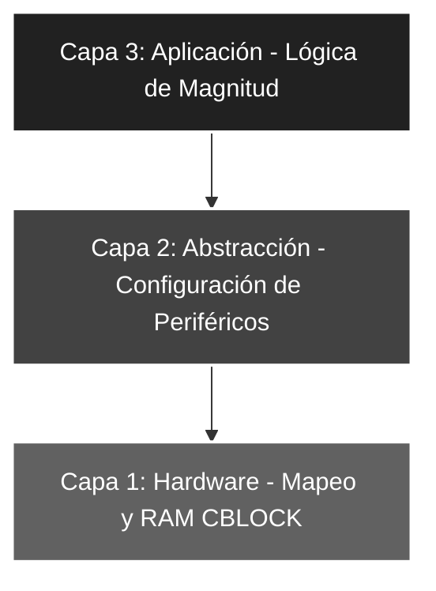

# 🚀 Saltos_03: Comparación de Magnitud y Lógica de Préstamo (Borrow)

## 🎯 Objetivos del Proyecto
* **Operadores Relacionales:** Implementar la lógica "Mayor o Igual" (`>=`) y "Menor que" (`<`) en Assembly.
* **Dominio del Carry (C):** Comprender el funcionamiento del bit de acarreo como indicador de préstamo (*Borrow*) en operaciones de sustracción.
* **Bifurcación con BTFSC:** Utilizar el testeo de bit con salto por limpieza para gestionar estados lógicos negativos.

---

## 📖 Teoría de Operación
En la arquitectura del PIC16F84A, las comparaciones de magnitud se realizan mediante la resta. Sin embargo, a diferencia de la igualdad (Z), la magnitud depende del bit **C (Carry)** del registro `STATUS`.

### 📝 Fundamentos del Carry como "No Borrow"
En una sustracción ($VALOR - W$), el bit **C** no funciona como un acarreo tradicional, sino como un indicador de **préstamo invertido**:

1. **Si $VALOR \ge W$:** El resultado es positivo o cero. La ALU **no necesita** pedir prestado de un bit superior. **Resultado: C = 1**.
2. **Si $VALOR < W$:** El resultado es negativo. La ALU **necesita** realizar un préstamo (*Borrow*). **Resultado: C = 0**.

$$C = 1 \implies \text{No hubo préstamo (Mayor o Igual)}$$
$$C = 0 \implies \text{Hubo préstamo (Menor)}$$

#### **Uso de BTFSC en Comparación**
En este laboratorio se utiliza `BTFSC STATUS, C` (*Bit Test f, Skip if Clear*). Esta instrucción permite detectar el evento de préstamo (C=0) para saltar inmediatamente a la rutina de valores menores, optimizando los ciclos de instrucción en la bifurcación.

**Ejemplo Práctico:**
Umbral de comparación: **.16**
* **Escenario A (Entrada = 20):** $20 - 16 = 4$. No hay préstamo $\rightarrow$ **C = 1**. `BTFSC` no salta, ejecuta el `goto MODO_ELSE` (Patrón `>=`).
* **Escenario B (Entrada = 10):** $10 - 16 = -6$. Hay préstamo $\rightarrow$ **C = 0**. `BTFSC` detecta el bit en '0' y **salta** el `goto`, entrando directamente a `MODO_IF` (Patrón `<`).

---

## 🏗️ Arquitectura del Software (Modelo de 3 Capas)

El sistema mantiene la jerarquía técnica para asegurar la estabilidad del procesamiento:


#### 🔹 Detalle Capa 1: Hardware y RAM
Se utiliza la directiva **CBLOCK** para **asignar direcciones de memoria de forma dinámica** a partir de la **dirección 0x0C**.

```asm
    CBLOCK  0x0C        ; Registros auxiliares en RAM
        VALOR_LEIDO     
        AUXILIAR        
    ENDC

NUMERO      EQU     .16 ; Umbral de comparación
LED_ON_1    EQU     b'11111111' ; Patrón para Mayor o Igual
LED_ON_2    EQU     b'01010101' ; Patrón para Menor
```
#### 🔹 Detalle Capa 2: CONFIGURACIÓN DE PERIFÉRICOS
Configuración de puertos mediante el acceso al Banco 1 y limpieza de registros para asegurar un estado inicial conocido.

```asm
CONFIG_PERIF
    BSF     STATUS, RP0     ; Acceso al Banco 1 para TRIS
    MOVLW   b'00011111'     ; Cargo máscara: RA<4:0> Entradas
    MOVWF   TRISA           ; Configuro PORTA
    CLRF    TRISB           ; PORTB como salida completa (8 bits)
    BCF     STATUS, RP0     ; Retorno al Banco 0 (Operaciones)
    
    CLRF    PORTB           ; Aseguro LEDs apagados al inicio
    ; Nota: No se limpia PORTA por ser registro de lectura física.
```
#### 🔹 Detalle Capa 3: Lógica de Aplicación
Implementación de la resta aritmética y el **testeo del bit de acarreo (Carry)** para la bifurcación.

```asm
MAIN
    MOVF    PORTA, W        ; Captura de puerto
    ANDLW   b'00011111'     ; Filtrado de bits RA<4:0>
    MOVWF   VALOR_LEIDO     
    
    MOVLW   NUMERO          
    SUBWF   VALOR_LEIDO, W  ; Operación: VALOR_LEIDO - 16
    
    BTFSC   STATUS, C       ; ¿Es menor? (C=0 indica préstamo)
    goto    MODO_ELSE       ; No saltó (C=1): Mayor o Igual
    
MODO_IF                     ; Etiqueta para Menor (C=0)
    MOVLW   LED_ON_2
    MOVWF   PORTB
    goto    MAIN
```
---

### 🛠️ Detalles de Robustez
* **Determinismo de Magnitud:** Al evaluar únicamente el bit **C**, garantizamos una respuesta de baja latencia ante cambios en el puerto, eliminando la necesidad de rutinas de comparación complejas o múltiples testeos de bits.
* **Gestión de Préstamo (Borrow):** Se asume la lógica de **"No-Borrow"** nativa de Microchip para asegurar que el valor exacto del umbral (**16**) sea incluido en la rama de "Mayor o Igual". Al ser $16 - 16 = 0$, la ALU no genera préstamo y el bit **C** se mantiene en **1**.
* **Filtro de Ruido (Masking):** El enmascaramiento previo a la resta mediante `ANDLW` asegura que los bits no utilizados del **PORTA** (RA5-RA7) no interfieran en el cálculo aritmético, evitando falsos positivos por estados indeterminados.

---

### 🗺️ Mapeo de Hardware

| Periférico | Pin PIC16F84A | Configuración | Función |
| :--- | :--- | :--- | :--- |
| **Switches** | RA0 - RA4 | Entrada (Pull-down) | Entrada de dato binario para comparación aritmética |
| **LED Array** | RB0 - RB7 | Salida (Push-pull) | Indicador visual de rango de magnitud ($\ge$ o $<$) |
| **Oscilador** | Cristal XT | 4 MHz | Referencia de tiempo para los ciclos de la ALU |

---

### 🎓 Conclusión
Este proyecto completa el estudio de los **saltos condicionales aritméticos**. La capacidad de distinguir entre magnitudes permite al desarrollador implementar sistemas de control por umbrales, tales como termostatos digitales o limitadores de velocidad. La comprensión profunda del bit **Carry** como indicador de préstamo es fundamental para dominar las operaciones matemáticas avanzadas y el procesamiento de señales en sistemas de 8 bits.

---
🛠️ *Estudiante de Ing. Electrónica @UTN_FRT | Apasionado por los Sistemas Embebidos y el Low-level (ASM/C).*
