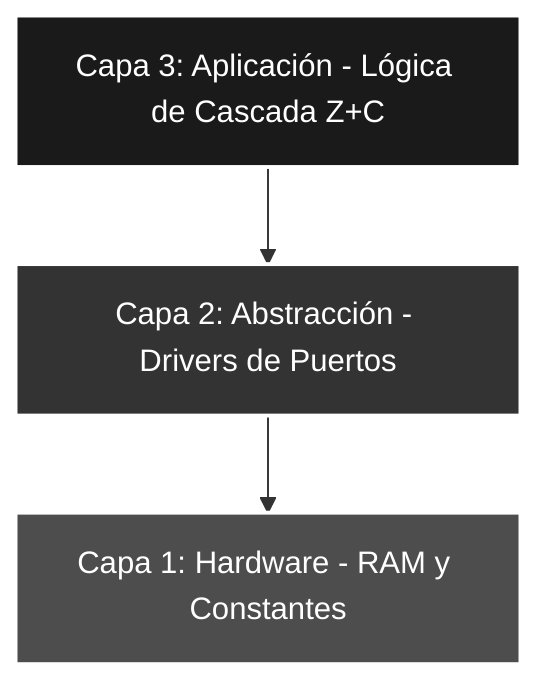

# 🚀 Saltos_04: Comparación de Magnitud Mayor Estricto (Cascada de Flags)

## 🎯 Objetivos del Proyecto
* **Lógica Relacional Compleja:** Implementar el operador "Mayor Estricto" ($>$) diferenciándolo del "Mayor o Igual" ($\ge$).
* **Evaluación de Flags Combinados:** Aprender a concatenar testeos de los bits **Z (Zero)** y **C (Carry)**.
* **Flujo de Decisión en Cascada:** Estructurar el código para descartar condiciones de forma jerárquica.

---

## 📖 Teoría de Operación y Lógica de Control

En este laboratorio abordamos el desafío de excluir la igualdad de una comparación de magnitud. Mientras que el operador $\ge$ solo requiere evaluar el **Carry**, el operador **Mayor Estricto** ($>$) requiere que se cumplan dos condiciones simultáneamente tras la ejecución de la resta ($VALOR - W$):

1. **Que el resultado no sea cero:** ($Z = 0$).
2. **Que no haya habido préstamo:** ($C = 1$).

### 📝 Lógica de Cascada (Double Filtering)

Para optimizar el código, aplicamos un filtro jerárquico que emula una compuerta **AND** lógica mediante saltos condicionales:

* **Filtro 1 (Igualdad):** Si el bit **Z** es 1, la operación resultó en cero. Por definición, el número no puede ser "mayor estricto", por lo que se desvía el flujo a la rama de "Menor o Igual".
* **Filtro 2 (Magnitud):** Si el programa supera el primer filtro, evaluamos el bit **C**. Si **C = 0**, hubo préstamo (*Borrow*), indicando que el valor es menor. Si **C = 1**, el valor es definitivamente mayor.

$$Condición \text{ ">" } \iff (Z=0) \land (C=1)$$

---

## 🧠 Análisis de Banderas de Estado (Registro STATUS)

En la arquitectura de 8 bits de Microchip, las comparaciones no son instrucciones nativas, sino resultados de operaciones aritméticas que afectan directamente al registro **STATUS**. El éxito de este algoritmo depende de dos *flags* críticos:

#### 1. La Bandera Z (Zero) - Indicador de Igualdad
El bit **Z** (`STATUS<2>`) informa si el resultado de la última operación fue exactamente cero.

* **Mecánica en Resta:**
    * **Si $Z = 1$:** Resultado nulo $\implies$ **$VALOR = W$**.
    * **Si $Z = 0$:** Resultado no nulo $\implies$ **$VALOR \neq W$**.
* **Rol en el código:** Actúa como el **disparador de exclusión** para el punto crítico de igualdad.

#### 2. La Bandera C (Carry) - Lógica de "No-Préstamo" (No-Borrow)
El bit **C** (`STATUS<0>`) actúa en sustracción como un indicador de **préstamo invertido**.

* **Mecánica en Resta:**
    * **Si $C = 1$ (No-Borrow):** El minuendo es mayor o igual al sustraendo ($VALOR \ge W$). La ALU no requirió un "préstamo" de un bit superior.
    * **Si $C = 0$ (Borrow):** El minuendo es menor al sustraendo ($VALOR < W$). La ALU generó un préstamo (*Borrow*).
* **Rol en el código:** Es el **determinante final de magnitud** una vez descartada la igualdad.

---

## 📊 Matriz de Decisión para Comparadores

Mediante la combinación de ambas banderas, es posible emular cualquier operador relacional de alto nivel en Assembly:

| Operador | Condición de Banderas | Lógica en Assembly |
| :--- | :--- | :--- |
| **Igualdad ($=$)** | $Z = 1$ | `BTFSS STATUS, Z` |
| **Distinto ($\neq$)** | $Z = 0$ | `BTFSC STATUS, Z` |
| **Mayor o Igual ($\ge$)** | $C = 1$ | `BTFSS STATUS, C` |
| **Menor ($<$)** | $C = 0$ | `BTFSC STATUS, C` |
| **Mayor Estricto ($>$)** | $Z = 0$ AND $C = 1$ | **Cascada:** `BTFSC Z` + `BTFSS C` |
| **Menor o Igual ($\le$)** | $Z = 1$ OR $C = 0$ | **Cascada invertida** |

---

## 🏗️ Arquitectura del Software (Modelo de 3 Capas)


#### 🔹 Detalle Capa 1: Hardware y RAM

Se utiliza la directiva CBLOCK para asignar direcciones de memoria de forma dinámica a partir de la dirección 0x0C, permitiendo una gestión ordenada de los registros de usuario.

```asm
    CBLOCK  0x0C        ; Inicio de RAM GPR (General Purpose Registers)
        VALOR_LEIDO     ; Registro para captura de PORTA
        AUXILIAR        ; Registro para procesos intermedios
    ENDC

NUMERO      EQU     .16 ; Umbral crítico de comparación (Excluyente)
LED_ON_1    EQU     b'11111111' ; Patrón para Mayor Estricto (>)
LED_ON_2    EQU     b'01010101' ; Patrón para Menor o Igual (=<)
```
#### 🔹 Detalle Capa 2: Configuración de Periféricos

Configuración de TRISA como entrada (5 bits) y TRISB como salida. Se garantiza el retorno al Banco 0 para asegurar que las operaciones de la ALU se realicen sobre los registros correctos.

```asm
CONFIG_PERIF
    BSF     STATUS, RP0    ; Acceso al Banco 1
    MOVLW   b'00011111'    ; RA<4:0> como entrada
    MOVWF   TRISA
    CLRF    TRISB          ; Puerto B como salida (8 bits)
    BCF     STATUS, RP0    ; Retorno al Banco 0 (Crucial para Capa 3)
    CLRF    PORTB          ; Inicialización de salidas en estado bajo
```
#### 🔹 Detalle Capa 3: Lógica de Aplicación (Comparación en Cascada)

Implementación del algoritmo de "Doble Filtro". Se evalúa primero la bandera Z para excluir la igualdad y luego la bandera C para determinar la magnitud mayor estricta.

```asm
MAIN
    MOVF    PORTA, W        ; Captura física del puerto
    ANDLW   b'00011111'     ; Máscara de bits útiles
    MOVWF   VALOR_LEIDO     ; Backup del dato en RAM
    
    MOVLW   NUMERO          ; W = 16
    SUBWF   VALOR_LEIDO, W  ; Operación: VALOR_LEIDO - 16
    
; --- INICIO DE CASCADA DE FLAGS ---
    BTFSC   STATUS, Z       ; 1er Filtro: ¿Z=0? (Skip if Clear)
    goto    MODO_ELSE       ; Si Z=1, son IGUALES (No cumple > 16)
    
    BTFSS   STATUS, C       ; 2do Filtro: ¿C=1? (Skip if Set)
    goto    MODO_ELSE       ; Si C=0, hubo préstamo (Es menor)

MODO_IF                     ; Solo se llega aquí si Z=0 y C=1 (Mayor Estricto)
    MOVLW   LED_ON_1
    MOVWF   PORTB
    goto    MAIN

MODO_ELSE                   ; Rama para casos Menor o Igual
    MOVLW   LED_ON_2
    MOVWF   PORTB
    goto    MAIN
```
---

### 🛠️ Detalles de Robustez

* **Determinismo en la Exclusión de Igualdad:** Mediante la implementación de un **filtro jerárquico de banderas**, se garantiza que el valor de referencia (**16**) sea discriminado antes de la evaluación de magnitud. Esto asegura el cumplimiento estricto del operador relacional **mayor estricto** ($>$), evitando falsos positivos en el umbral crítico de comparación.

* **Optimización de Latencia y Ciclos de Máquina:** El algoritmo ha sido diseñado para descartar condiciones de falsedad en una ventana de **2 a 4 ciclos de instrucción** (equivalente a $4 \mu s$ trabajando con un cristal de 4 MHz). Esta baja latencia de respuesta es fundamental en sistemas de control de tiempo real donde el determinismo temporal es una métrica crítica de desempeño.

* **Integridad de Datos y Persistencia en RAM:** A diferencia de una operación destructiva sobre el acumulador (W), se utiliza el registro `VALOR_LEIDO` para **preservar la muestra original** del puerto. Esta arquitectura de "lectura con respaldo" previene la pérdida de información durante el proceso de sustracción en la ALU, facilitando tareas de auditoría de datos y depuración (*debugging*) sin alterar el estado global del sistema.

---

### 🗺️ Mapeo de Hardware

| Componente | Pin PIC16F84A | Configuración | Función |
| :--- | :--- | :--- | :--- |
| **DIP-Switch** | RA<4:0> | Entrada | Ingreso de dato binario (0-31) |
| **Barra LEDs** | RB<7:0> | Salida | Visualización del resultado lógico |
| **Reloj** | Cristal XT | 4 MHz | Sincronía para las operaciones de la ALU |

---

### 🎓 Conclusión
Este laboratorio representa la culminación del estudio de los comparadores simples. La implementación de **lógica combinada (Z y C)** permite al desarrollador construir sistemas de control con **histéresis** o ventanas de comparación (*window comparators*), herramientas fundamentales en la instrumentación electrónica y la robótica de precisión.

---
🛠️ *Estudiante de Ing. Electrónica @UTN_FRT | Apasionado por los Sistemas Embebidos y el Low-level (ASM/C).*