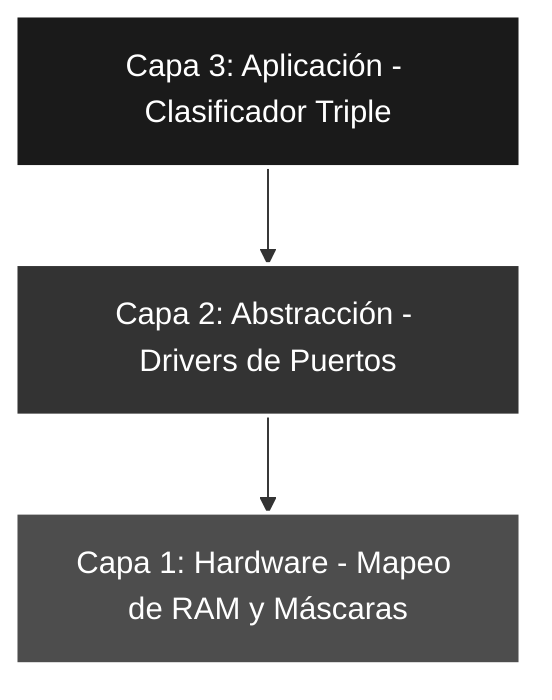

# 🚀 Saltos_05: Discriminador de Triple Estado (Lógica de Comparación Total)

## 🎯 Objetivos del Proyecto
* **Clasificación de Magnitud:** Implementar un algoritmo capaz de bifurcar el flujo en tres estados excluyentes: **Mayor**, **Menor** e **Igual**.
* **Dominio del Registro STATUS:** Utilizar de forma combinada las banderas **Z (Zero)** y **C (Carry)** para la toma de decisiones.
* **Optimización de Saltos:** Estructurar una cascada de decisiones jerárquica para minimizar los ciclos de instrucción.

---

## 📖 Teoría de Operación y Lógica de Control

En este laboratorio se desarrolla la capacidad de clasificar una entrada de 5 bits respecto a un umbral fijo ($NUMERO = 16$). A diferencia de los laboratorios anteriores, aquí el sistema debe responder de forma unívoca a tres condiciones relacionales tras la ejecución de la resta ($VALOR - W$):

### 📝 Mapa de Banderas (Truth Table)
Para lograr esta triple bifurcación, analizamos el estado de la ALU mediante el registro `STATUS`:

| Condición | Flag **Z** | Flag **C** | Significado Físico |
| :--- | :---: | :---: | :--- |
| **VALOR = 16** | **1** | **1** | Resultado nulo (Igualdad). |
| **VALOR > 16** | **0** | **1** | Resultado positivo, sin préstamo (Mayor). |
| **VALOR < 16** | **0** | **0** | Resultado negativo, con préstamo (Menor). |

### ⛓️ Cascada de Decisión Jerárquica
El algoritmo aplica un **doble filtrado**:
1. **Filtro de Igualdad (Z):** Es la condición más restrictiva. Si $Z=1$, el flujo se desvía inmediatamente al caso "Igual".
2. **Filtro de Magnitud (C):** Si $Z=0$, el bit **C** actúa como el discriminador final para separar el conjunto de los "Mayores" de los "Menores".

$$Condición \text{ "Triple" } \implies f(Z, C)$$

---

## 🏗️ Arquitectura del Software (Modelo de 3 Capas)


#### 🔹 Detalle Capa 1: Hardware y RAM

Se definen los registros en la GPR RAM y las constantes de visualización para cada estado lógico.

```asm
    CBLOCK  0x0C        
        VALOR_LEIDO     ; Backup del PORTA filtrado
        AUXILIAR        
    ENDC

NUMERO      EQU     .16 ; Umbral de comparación
LED_ON_1    EQU     b'11111111' ; Todos ON (Si es Igual)
LED_ON_2    EQU     b'01010101' ; Pares ON (Si es Mayor)
LED_ON_3    EQU     b'11110000' ; Nibble Alto ON (Si es Menor)
```
#### 🔹 Detalle Capa 2: Configuración de Periféricos

Gestión de bancos de memoria para la configuración de dirección de datos (TRIS) y aseguramiento de un estado inicial determinista en las salidas.

```asm
CONFIG_PERIF
    BSF     STATUS, RP0    ; Banco 1
    MOVLW   b'00011111'    ; Entradas en RA
    MOVWF   TRISA
    CLRF    TRISB          ; Salidas en RB
    BCF     STATUS, RP0    ; Banco 0
    CLRF    PORTB          ; Estado inicial: todo apagado
```
#### 🔹 Detalle Capa 3: Lógica de Aplicación

Implementación del algoritmo de descarte sucesivo de banderas.

```asm
; --- Algoritmo de Decisión ---
    BTFSC   STATUS, Z       ; ¿Es cero? (Skip if Clear)
    goto    MODO_ELSE       ; Si Z=1 -> Bifurca a IGUAL
    
    BTFSS   STATUS, C       ; ¿Es C=1? (Skip if Set)
    goto    MODO_ELSE_IF    ; Si C=0 -> Bifurca a MENOR

MODO_IF                     ; Si llega aquí -> Es MAYOR
    MOVLW   LED_ON_2
    MOVWF   PORTB
    goto    MAIN
```

---

### 🛠️ Detalles de Robustez

* **Determinismo en la Clasificación:** Mediante la implementación de un **filtrado jerárquico de banderas**, se garantiza una respuesta rápida, unívoca y libre de ambigüedades en los umbrales de transición ($=, >, <$).
* **Optimización de Latencia y Tiempo Real:** El diseño de la cascada de saltos permite que el microcontrolador tome la decisión lógica en un intervalo de **2 a 6 ciclos de instrucción**. Esto asegura una latencia estable, fundamental para sistemas de control de lazo cerrado.
* **Persistencia de Datos (Non-Destructive Read):** El uso del registro `VALOR_LEIDO` protege la integridad de la muestra original. Esto evita que la naturaleza destructiva de la operación `SUBWF` en el acumulador W afecte la disponibilidad del dato para procesos posteriores.

---

### 🗺️ Mapeo de Hardware

| Componente | Pin PIC16F84A | Configuración | Función |
| :--- | :--- | :--- | :--- |
| **DIP-Switch** | RA<4:0> | Entrada | Ingreso de dato binario (Rango 0-31) |
| **Barra LEDs** | RB<7:0> | Salida | Indicador visual de estado lógico ($=, >, <$) |
| **Reloj** | Cristal XT | 4 MHz | Sincronía de la ALU y base de tiempo |

---

### 🎓 Conclusión

Este laboratorio representa el dominio avanzado de los **saltos condicionales y comparadores aritméticos**. La capacidad de clasificar una señal en tres estados diferenciados es la base fundamental para el diseño de controladores de lazo cerrado (como sistemas On/Off con zona muerta), algoritmos de seguridad por umbrales y la lógica de toma de decisiones en robótica móvil y navegación.

---
🛠️ *Estudiante de Ing. Electrónica @UTN_FRT | Apasasionado por los Sistemas Embebidos y el Low-level (ASM/C).*