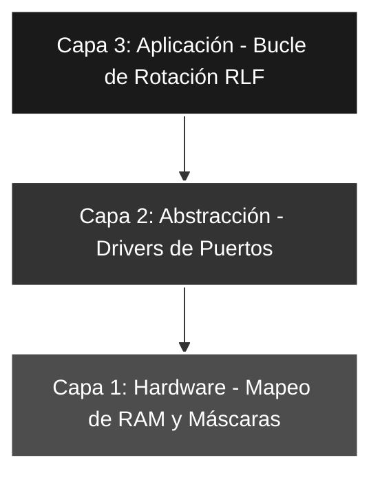

# 🚀 Saltos_06: Generador de Patrones Dinámicos mediante Rotación (RLF)

## 🎯 Objetivos del Proyecto
* **Algoritmos Iterativos:** Implementar bucles dinámicos controlados por entradas externas.
* **Manipulación de Bits:** Dominar la instrucción de rotación a través del acarreo (**RLF**).
* **Conversión Valor-Cantidad:** Transformar un número binario en una barra de visualización proporcional.

---

## 📖 Teoría de Operación y Lógica de Control

Este laboratorio introduce el concepto de **generación dinámica de datos**. En lugar de seleccionar un patrón predefinido, el programa "construye" la salida en el **PORTB** basándose en el valor leído en **PORTA <2:0>**.

### 📝 El Algoritmo de Llenado
La lógica se basa en el desplazamiento serial de un bit de "relleno" hacia un registro paralelo:

1. **Inicialización:** Se limpia el `PORTB` y se carga el valor de entrada en un registro `CONTADOR`.
2. **Inyección de Bit:** Se fuerza el bit de **Carry (C)** a '1' mediante la instrucción `BSF`.
3. **Rotación:** La instrucción `RLF PORTB, F` desplaza todos los bits hacia la izquierda, introduciendo el valor del Carry en el bit menos significativo (LSB).
4. **Iteración:** El proceso se repite tantas veces como indique el contador, generando una barra de LEDs continua.

$$Patrón = \sum_{i=0}^{n-1} 2^i \text{ donde } n = VALOR\_RA$$

---

## 🏗️ Arquitectura del Software (Modelo de 3 Capas)


#### 🔹 Detalle Capa 1: Hardware y RAM

Se reserva espacio para el registro de control de bucle y se definen las máscaras de filtrado para asegurar que solo se procesen los 3 bits bajos de la entrada.

```asm
    CBLOCK  0x0C        
        VALOR_LEIDO     ; Backup del dato
        CONTADOR        ; Registro de control de iteraciones
    ENDC
```
#### 🔹 Detalle Capa 2: Configuración de Periféricos

Se establece la dirección de flujo de datos mediante los registros de control TRIS. Se prioriza la seguridad del sistema mediante la limpieza de latches de salida antes de activar los drivers del puerto.

```asm
CONFIG_PERIF
    BSF     STATUS, RP0    ; Acceso al Banco 1 (Configuración)
    MOVLW   ENTRADAS       ; Carga máscara b'00000111'
    MOVWF   TRISA          ; RA<2:0> como entrada, resto salida
    CLRF    TRISB          ; PORTB configurado íntegramente como salida
    BCF     STATUS, RP0    ; Retorno al Banco 0 (Operación)
    
    CLRF    PORTB          ; Inicialización determinista (Evita destellos basura)
```
#### 🔹 Detalle Capa 3: Lógica de Aplicación

Implementación del bucle DECFSZ para controlar la inyección de bits.

```asm
MAIN
    ; ... (Captura y filtrado) ...
    BTFSC   STATUS, Z    ; Filtro preventivo de entrada nula
    goto    MAIN 

BUCLE    
    BCF     STATUS, C    ; Limpieza de seguridad
    BSF     STATUS, C    ; Inyección de bit de relleno (1 lógico)
    RLF     PORTB, F     ; Desplazamiento a la izquierda
    DECFSZ  CONTADOR, F  ; Decremento y salto si es cero
    goto    BUCLE        ; Iteración de llenado
    goto    MAIN         ; Retorno al ciclo principal
```
---

### 🛠️ Detalles de Robustez

* **Prevención de Overflow:** Se implementa un testeo preventivo de la bandera **Z** (Zero) antes de ingresar al bucle. Esto evita que un valor de entrada nulo (`000`) sea interpretado por la instrucción `DECFSZ` como un decremento desde cero, lo cual resultaría en un desbordamiento de **256 iteraciones** no deseadas.
* **Sincronismo de Acarreo (Carry Control):** El bit de **Carry** se gestiona de forma explícita dentro del cuerpo del bucle (`BCF` seguido de `BSF`). Esto garantiza que el patrón de "llenado" de la barra sea siempre de '1's lógicos, independientemente del estado previo de la ALU tras operaciones aritméticas anteriores.
* **Escalabilidad Arquitectónica:** El algoritmo diseñado es altamente modular. Su lógica de desplazamiento permite adaptarlo fácilmente a arquitecturas de 16 o 32 bits (como **AVR** o **ARM**) simplemente extendiendo los registros de rotación y ajustando el contador de iteraciones.

---

### 🗺️ Mapeo de Hardware

| Componente | Pin PIC16F84A | Configuración | Función |
| :--- | :--- | :--- | :--- |
| **DIP-Switch** | RA<2:0> | Entrada | Define la cantidad de LEDs a encender (0-7) |
| **Barra LEDs** | RB<7:0> | Salida | Representación visual tipo "Barra de Progreso" |
| **Reloj** | Cristal XT | 4 MHz | Referencia de frecuencia para los ciclos de máquina |

---

### 🎓 Conclusión

Este proyecto demuestra cómo la manipulación directa de los registros de desplazamiento y las banderas de estado puede sustituir complejas estructuras de decisión (`IF-ELSE`), optimizando drásticamente el uso de memoria de programa y el tiempo de respuesta de la CPU. Este método constituye la base técnica para el manejo de **protocolos de comunicación serial** (como SPI o I2C) y el control eficiente de matrices de LEDs mediante registros de desplazamiento externos.

---
🛠️ *Estudiante de Ing. Electrónica @UTN_FRT | Apasionado por los Sistemas Embebidos y el Low-level (ASM/C).*