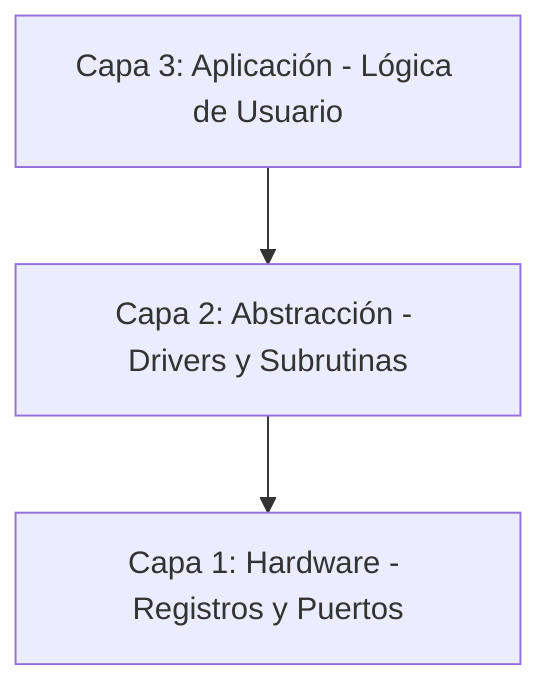

# 🚀 PIC16F84A Mastery: Arquitectura y Migración Profesional

Este repositorio documenta mi proceso de especialización en sistemas embebidos de 8 bits, centrando el estudio en el **Microchip PIC16F84A**. El proyecto evoluciona desde el aprendizaje académico con el estándar **MPASM** (siguiendo la bibliografía de *Palacios, Remiro, López y Castro*) hacia la implementación profesional en **PIC-AS (XC8)**.

---

## 🎯 Objetivos del Proyecto
* **Dominio del Silicio:** Comprender el set de 35 instrucciones RISC y la gestión crítica de memoria (Bancos, Stack, SFR).
* **Transición Tecnológica:** Migrar código *legacy* a entornos modernos utilizando **VS Code**, **Makefiles** y el compilador **pic-as**.
* **Rigor de Ingeniería:** Implementar drivers de periféricos básicos (GPIO, Timers, EEPROM) bajo una arquitectura robusta.

---

## 🏗️ Arquitectura del Software
El desarrollo se organiza bajo una estructura de **tres capas** para asegurar escalabilidad y facilitar el mantenimiento del código:

---

## 🏗️ Arquitectura del Software (Modelo de 3 Capas)

El desarrollo se organiza bajo una estructura jerárquica para asegurar la escalabilidad y facilitar el mantenimiento del código:

* **Capa 1 (Hardware):** Manipulación directa de registros `STATUS`, `PORT`, `TRIS` y configuración de *fuses* (`__CONFIG`). Es la base que interactúa con el silicio.
* **Capa 2 (Abstracción):** Implementación de subrutinas de retardo (*Delays*), manejo de tablas de verdad (`RETLW`) y control de periféricos mediante drivers propios.
* **Capa 3 (Aplicación):** Integración de funciones y lógica de control para proyectos finales, como el **Contador 0-99**.

---

## 🛠️ Entorno de Desarrollo

Para garantizar un flujo de trabajo profesional, se utiliza el siguiente *stack* tecnológico:

* **IDE:** MPLAB X.
* **Compilador:** MPASM (Fase 1: Aprendizaje) / pic-as (Fase 2: Migración profesional).
* **Hardware:** Microchip **PIC16F84A**.
* **Herramientas:** MPLAB IPE, Programador PICkit 3.

---

## 📌 Roadmap de Aprendizaje: El Camino del Guerrero (Basado en Palacios)

Este itinerario sigue la progresión pedagógica del libro *"Microcontrolador PIC16F84. Desarrollo de proyectos"*, dividida en fases de complejidad incremental.

### 🟦 Fase 1: Fundamentos de I/O y Registros (Cap. 4 y 5)
*Dominio de la estructura de archivos, configuración de fuses y manejo de puertos.*
- [x] **Lab 01 (Ensam_01):** Visualización de constantes binarias en el Puerto B.
- [x] **Lab 02 (Ensam_02):** Manipulación de *nibbles* y bits individuales.
- [x] **Lab 03 (Ensam_03):** Lectura del Puerto A y reflejo en Puerto B (Estructura E/S).

### 🟩 Fase 2: Lógica y Aritmética Elemental (Cap. 8)
*Entrenamiento intensivo en el set de instrucciones RISC y la Unidad Aritmético Lógica (ALU).*
- [ ] **Elemental 01:** Suma de `PORTA` + Constante decimal (Instrucción `ADDLW`).
- [ ] **Elemental 02:** Multiplicación por 2 mediante suma propia (`PORTA` + `PORTA`).
- [ ] **Elemental 03:** Máscaras lógicas **OR** (Fijar bits pares a "1" con `IORLW`).
- [ ] **Elemental 04:** Máscaras lógicas **AND** (Fijar bits impares a "0" con `ANDLW`).
- [ ] **Elemental 05:** Inversión de datos (Instrucción `COMF` - Lógica NOT).
- [ ] **Elemental 06:** Intercambio de *nibbles* (Instrucción `SWAPF`).
- [ ] **Elemental 07/08:** Desplazamientos laterales (Instrucciones de rotación `RLF` y `RRF`).
- [ ] **Elemental 09:** Inversión selectiva mediante **XOR** (`XORLW`).
- [ ] **Elemental 10:** Gestión de energía y modo bajo consumo (`SLEEP`).

### 🟨 Fase 3: Control de Flujo y Subrutinas (Cap. 9 y 10)
*Abstracción de funciones para crear código modular y reutilizable.*
- [ ] **Lab 04:** Implementación de retardos por software (Bucles anidados).
- [ ] **Lab 05:** Manejo de tablas de datos con `RETLW` (Binario a 7-Segmentos).
- [ ] **Lab 06:** Control de un Display LED mediante multiplexación.

### 🟧 Fase 4: Periféricos y Eventos de Hardware (Cap. 11, 12 y 13)
*Uso de los módulos internos del silicio para tareas críticas.*
- [ ] **Lab 07:** Configuración del **Timer0** como temporizador y prescaler.
- [ ] **Lab 08:** Contador de eventos externos por el pin `RA4/T0CKI`.
- [ ] **Lab 09:** Gestión de **Interrupciones** (Externa `RB0/INT` y por TMR0).
- [ ] **Lab 10:** Lectura y escritura en la memoria **EEPROM** interna.

### 🟥 Fase 5: Proyecto Integrador y Migración Profesional
*Consolidación de conocimientos y salto al estándar industrial.*
- [ ] **Proyecto Final:** Contador 0-99 con doble display y control de flujo.
- [ ] **Migración PIC-AS:** Refactorización de todos los laboratorios a la sintaxis moderna de **XC8**.

---

## 💡 Lecciones Aprendidas (Engineering Notes)

> [!IMPORTANT]
> Notas técnicas recopiladas durante el testeo en hardware real.

* **Hardware:** Importancia crítica del pin **MCLR** (requiere *Pull-up* de 10k) y la estabilidad del oscilador **XT** para evitar resets inesperados y asegurar la ejecución del código.
* **Software:** La gestión prolija del bit **RP0** en el registro `STATUS` es vital para evitar colisiones de direccionamiento entre el **Banco 0** y el **Banco 1**.

---

## 🤝 Contacto

**Carlos** - Estudiante de Ingeniería Electrónica (**UTN FRT**)
* Enfoque en Sistemas Embebidos, Robótica y Micromouse.

---