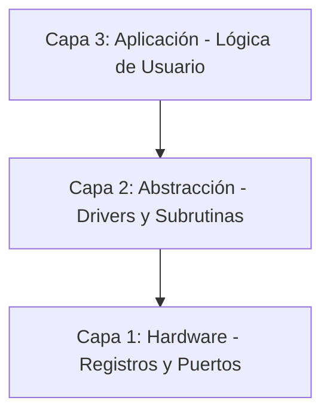

# 🚀 PIC16F84A Mastery: Arquitectura y Migración Profesional

Este repositorio documenta mi proceso de especialización en sistemas embebidos de 8 bits, centrando el estudio en el **Microchip PIC16F84A**. El proyecto evoluciona desde el aprendizaje académico con el estándar **MPASM** (siguiendo la bibliografía de *Palacios, Remiro, López y Castro*) hacia la implementación profesional en **PIC-AS (XC8)**.

---

## 🎯 Objetivos del Proyecto
* **Dominio del Silicio:** Comprender el set de 35 instrucciones RISC y la gestión crítica de memoria (Bancos, Stack, SFR).
* **Transición Tecnológica:** Migrar código *legacy* a entornos modernos utilizando **VS Code**, **Makefiles** y el compilador **pic-as**.
* **Rigor de Ingeniería:** Implementar drivers de periféricos básicos (GPIO, Timers, EEPROM) bajo una arquitectura robusta.

---

## 🏗️ Arquitectura del Software
El desarrollo se organiza bajo una estructura de **tres capas** para asegurar escalabilidad y facilitar el mantenimiento del código:

---

## 🏗️ Arquitectura del Software (Modelo de 3 Capas)

El desarrollo se organiza bajo una estructura jerárquica para asegurar la escalabilidad y facilitar el mantenimiento del código:

* **Capa 1 (Hardware):** Manipulación directa de registros `STATUS`, `PORT`, `TRIS` y configuración de *fuses* (`__CONFIG`). Es la base que interactúa con el silicio.
* **Capa 2 (Abstracción):** Implementación de subrutinas de retardo (*Delays*), manejo de tablas de verdad (`RETLW`) y control de periféricos mediante drivers propios.
* **Capa 3 (Aplicación):** Integración de funciones y lógica de control para proyectos finales, como el **Contador 0-99**.

---

## 🛠️ Entorno de Desarrollo

Para garantizar un flujo de trabajo profesional, se utiliza el siguiente *stack* tecnológico:

* **IDE:** VS Code / MPLAB X.
* **Compilador:** MPASM (Fase 1: Aprendizaje) / pic-as (Fase 2: Migración profesional).
* **Hardware:** Microchip **PIC16F84A**.
* **Herramientas:** Makefiles, GDB (Debug) y programadores PICkit / K150.

---

## 📌 Roadmap de Aprendizaje

- [x] **Lab 01:** Configuración inicial y manejo de Puertos (GPIO).
- [x] **Lab 02:** Gestión de Bancos de Memoria y Registro `STATUS`.
- [ ] **Lab 03:** Implementación de retardos por software (Anidamiento de bucles).
- [ ] **Lab 04:** Manejo de Interrupciones Externas y TMR0.
- [ ] **Lab 05:** Escritura y Lectura en EEPROM interna.
- [ ] **Migración:** Refactorización completa de los laboratorios a sintaxis **PIC-AS**.

---

## 💡 Lecciones Aprendidas (Engineering Notes)

> [!IMPORTANT]
> Notas técnicas recopiladas durante el testeo en hardware real.

* **Hardware:** Importancia crítica del pin **MCLR** (requiere *Pull-up* de 10k) y la estabilidad del oscilador **XT** para evitar resets inesperados y asegurar la ejecución del código.
* **Software:** La gestión prolija del bit **RP0** en el registro `STATUS` es vital para evitar colisiones de direccionamiento entre el **Banco 0** y el **Banco 1**.

---

## 🤝 Contacto

**Carlos** - Estudiante de Ingeniería Electrónica (**UTN FRT**)
* Enfoque en Sistemas Embebidos, Robótica y Micromouse.

---