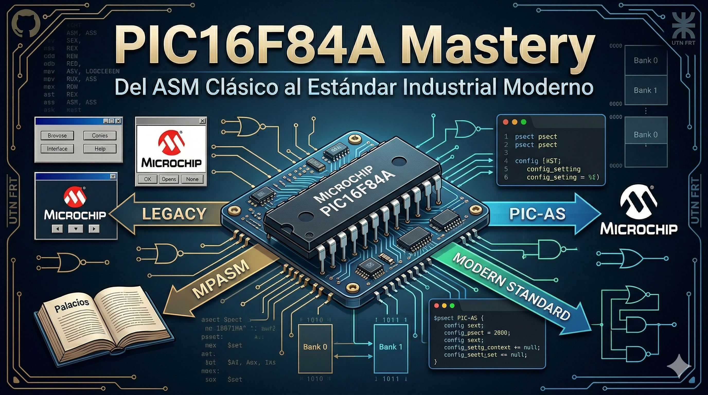
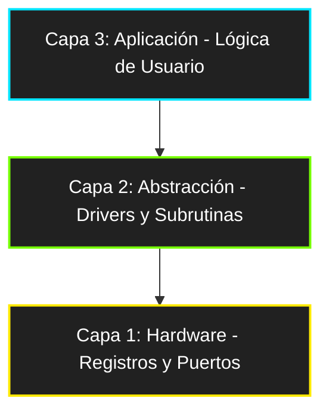

  
  
  
  
  
 

  # PIC16F84A-Mastery

  *"Explorando el silicio desde sus cimientos: Un recorrido metodológico por la arquitectura de 8 bits, desde el ASM clásico hasta el estándar industrial moderno."*

---

Este repositorio documenta mi especialización en sistemas embebidos de 8 bits, centrando el estudio en el **Microchip PIC16F84A**. El proyecto evoluciona desde el aprendizaje académico con el estándar legacy **MPASM** (siguiendo la bibliografía de *Palacios, Remiro, López y Castro*) hacia la implementación profesional en **PIC-AS (XC8)**.

---

## 🎯 Objetivos del Proyecto
* **Dominio del Silicio:** Comprender el set de 35 instrucciones RISC y la gestión crítica de memoria (Bancos, Stack, SFR).
* **Transición Tecnológica:** Migrar código *legacy* a entornos modernos utilizando **MPLAB X** y el compilador moderno **pic-as**.
* **Rigor de Ingeniería:** Implementar drivers de periféricos (GPIO, Timers, EEPROM) bajo una arquitectura robusta de tres capas.

---

## 📂 Explorar el Repositorio

| Directorio | Contenido | Estado |
| :--- | :--- | :--- |
| **[ASM_MPASM](./ASM_MPASM/)** | Laboratorios y ejercicios del libro de Palacios. | 🛠️ En Progreso |
| **[ASM_PICAS](./ASM_PICAS/)** | Refactorización a estándar moderno XC8. | ⏳ Pendiente |
| **[docs](./Docs/)** | Datasheets y notas técnicas de consulta. | ✅ Disponible |

---

## 🏗️ Arquitectura del Software (Modelo de 3 Capas)

El desarrollo se organiza bajo una estructura jerárquica para asegurar la escalabilidad y facilitar el mantenimiento del código:

* **Capa 1 (Hardware):** Manipulación directa de registros `STATUS`, `PORT`, `TRIS` y configuración de *fuses* (`__CONFIG`). Es la base que interactúa directamente con el silicio.
* **Capa 2 (Abstracción):** Implementación de subrutinas de retardo (*Delays*), manejo de tablas de verdad mediante `RETLW` y desarrollo de drivers propios para periféricos.
* **Capa 3 (Aplicación):** Integración de funciones y lógica de control para proyectos finales, como el **Contador 0-99**.

---

## 🛠️ Entorno de Desarrollo

Para garantizar un flujo de trabajo profesional y reproducible, se utiliza el siguiente *stack* tecnológico oficial:

| Componente | Herramienta / Modelo |
| :--- | :--- |
| **IDE** | **MPLAB X IDE** |
| **Compilador** | MPASM (Fase 1: Aprendizaje) / **pic-as** (Fase 2: Migración) |
| **Hardware** | Microchip **PIC16F84A** |
| **Programación** | **MPLAB IPE**, Programador PICkit 3 / K150 |

---

## 🎓 Conclusión y Finalidad del Proyecto

La elección del **PIC16F84A** como eje central de este repositorio no es casual. A pesar de ser un microcontrolador de arquitectura simplificada, representa el **"gimnasio mental"** ideal para cualquier desarrollador de sistemas embebidos.

### ¿Por qué esta base es fundamental?
* **Arquitectura Harvard Pura:** Entender la separación física entre la memoria de programa y la de datos es la base para optimizar sistemas más complejos.
* **Determinismo Técnico:** En ASM, cada instrucción cuenta. Dominar el ciclo de máquina en este micro permite predecir el comportamiento temporal en arquitecturas superiores.
* **Escalabilidad de Conocimiento:** Los conceptos aquí vertidos (gestión de bancos, registros especiales y lógica booleana) son directamente transferibles a dispositivos *Mid-range* como el **PIC16F628A** o el **PIC16F877A**. La disciplina de programar "cerca del silicio" facilita la transición a arquitecturas **AVR** o **ARM**.

---

## 📚 Referencias Bibliográficas y Derechos de Autor

> [!WARNING]
> **Aviso Legal:** El código fuente y los ejemplos contenidos en este repositorio están inspirados o basados en la bibliografía citada y en las hojas de datos oficiales de Microchip Technology Inc. Se publican exclusivamente con fines educativos y de investigación personal. Todos los derechos sobre las obras originales pertenecen a sus respectivos autores.

### Bibliografía Principal
* Palacios, E., Remiro, F., López, J. M., & Castro, J. M. (2006). *Microcontrolador PIC16F84: Desarrollo de proyectos* (3ra ed.). Editorial Alfaomega. **ISBN-13: 978-8426713919**.
  *(El desarrollo metodológico de MPASM en este repositorio sigue la línea pedagógica de esta obra).*

### Documentación Técnica (Datasheets)
* **Microchip Technology Inc. (2001).** *PIC16F84A Data Sheet: 18-pin Enhanced Flash/EEPROM 8-Bit Microcontrollers* (DS35007B). [Disponible aquí](https://ww1.microchip.com/downloads/en/DeviceDoc/35007b.pdf).

### Atribuciones de Entorno
* **MPLAB® X IDE, MPASM™ y PIC-AS™** son marcas registradas de Microchip Technology Inc. El uso de estos nombres es estrictamente referencial para describir el *toolchain* utilizado.

---

## ⚖️ Licencia

Este proyecto está bajo la Licencia **MIT** - vea el archivo [LICENSE](LICENSE) para más detalles.

---

## 🤝 Contacto

**Carlos** - Estudiante de Ingeniería Electrónica (**UTN FRT**)
* 🛠️ *Apasionado por los Sistemas Embebidos, la Robótica y el Low-level (ASM/C).*

---